# EDS 注塑机台主数据维护 操作手册

> **版本**：V20261001.01
> **适用系统**：EDS 设备数字化系统（Equipment Digital System）
> **适用对象**：设备部全体同事（登录 EDS 后谁都能改，没有权限门槛）
> **怎么用这本手册**：第一次用先看 [§2 先看懂这张表](#2-先看懂这张表重要)，那是最关键的一节；之后照着 [§3 怎么改](#3-怎么改) 一步步做就行。

---

## 0. 目录

- [1. 这个模块能帮你做什么](#1-这个模块能帮你做什么)
- [2. 先看懂这张表（重要）](#2-先看懂这张表重要)
- [3. 怎么改](#3-怎么改)
- [4. 保存](#4-保存)
- [5. 别人同时在改怎么办（冲突提醒）](#5-别人同时在改怎么办冲突提醒)
- [6. 撤销、刷新、关页面](#6-撤销刷新关页面)
- [7. 看变更日志：谁在什么时候改了什么](#7-看变更日志谁在什么时候改了什么)
- [8. 找机台、筛机台](#8-找机台筛机台)
- [9. 列太多看着累？用「显示分组列」开关](#9-列太多看着累用显示分组列开关)
- [10. 这些列为什么改不了](#10-这些列为什么改不了)
- [11. 常见问题](#11-常见问题)
- [12. 几条要记住的](#12-几条要记住的)
- [13. 版本记录](#13-版本记录)

---

## 1. 这个模块能帮你做什么

以前要改机台的机型、责任人、免检标记，只能打开 Google 表格直接在单元格里敲字——容易敲错、改了什么没人知道、多人同时改还会互相覆盖。

现在有了维护页：

| 以前 | 现在 |
|---|---|
| 打开表格找行找列，手动输入 | 网页上点下拉、打勾 |
| 输错字没人拦 | 下拉只能选已有选项，不会输错 |
| 谁改的、改前是什么，查不到 | 「变更日志」全部记下来 |
| 两个人同时改可能互相覆盖 | 系统会拦下并告诉你哪一格已被别人改过 |

**一句话**：把机台属性列的维护从"手敲表格"变成"网页上点选+留痕"。

---

## 2. 先看懂这张表（重要）

进入方式：**登录 EDS → 导航页 → 「主数据维护」卡片 → 「注塑机台主数据」**

维护提醒邮件里的「注塑机台主数据维护页」链接同样**要先登录**：点进去先落 EDS 登录页，登录成功后自动回到本页。未登录时直接把 `?v=INJ_MachineMaster` 贴进浏览器（旧邮件、书签）也进不去——页面不会加载任何数据，只会显示一个「去登录」按钮，点它即可。

> 

> 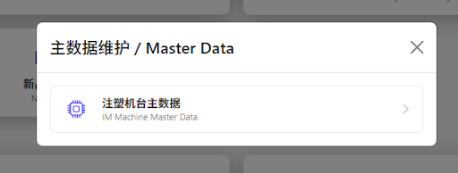

打开的页面长这样：

> 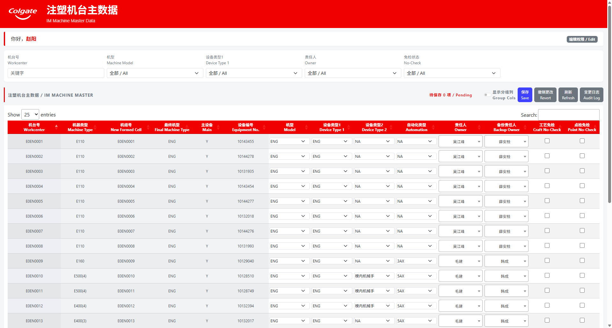

整张表一共 **20 列**，从中间分开，性质完全不同：

### 左边 12 列：只读（灰色底）——给你对照用的

机台号、机器类型、机器性能、机组号、HIM/Auto、VIM-1~4、最终机型、主设备、设备编号。

**这些列在本页面改不了**，鼠标点上去也没反应。原因是它们被别的模块依赖着（详见 [§10](#10-这些列为什么改不了)）。

### 右边 8 列：可编辑——这才是你来这儿要改的

| 列名 | 怎么改 | 说明 |
|---|---|---|
| 机型 | 下拉选择 | 选项来自表格里的「机型选项」 |
| 设备类型1 | 下拉选择 | 末位固定有 `NA`（不适用） |
| 设备类型2 | 下拉选择 | 末位固定有 `NA`（不适用） |
| 自动化类型 | 下拉选择 | 末位固定有 `NA`（不适用） |
| 责任人 | 可搜索下拉 | 输入姓氏即可筛选，人很多也能找到 |
| 备份责任人 | 可搜索下拉 | |
| 工艺免检 | 勾选框 | **勾上 = 该机台工艺项无需检查** |
| 点检免检 | 勾选框 | **勾上 = 该机台点检项无需检查** |

> 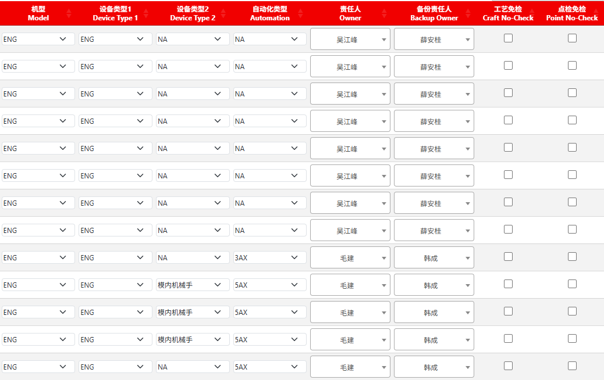

> **两个免检勾选框要特别说清楚**：
> - **勾上** → 表格里写入 `Y`
> - **取消勾选** → 表格里写入**空白**（不是 N、也不是 FALSE）
>
> 也就是说，"没勾"和"空着"是一回事。

---

## 3. 怎么改

### 3.1 下拉选择（机型、设备类型1、设备类型2、自动化类型）

点单元格里的下拉框 → 从列表里选一个。列表里没有你要的值时，选空白即可，**不要硬填**（这里是下拉框，也敲不进自定义内容）。

**设备类型1 / 设备类型2 / 自动化类型 这三列的列表末尾固定有个 `NA`**，表示"不适用"（比如这台机没有自动化类型）。它的位置在真实机型后面：

```
（空白）→ 3AX → 6AX → … → NA
```

> **`NA` 和"空白"不是一回事**：空白 = 还没填 / 不清楚；`NA` = 确认过，这台机就是不适用。填哪个看你想表达的意思。
>
> 页面顶部的「设备类型1」筛选框里也有 `NA`，选了就能把标了 `NA` 的机台筛出来。

### 3.2 责任人 / 备份责任人（可以搜）

这两列人比较多，点开后**直接输入姓名**就能筛。也可以输入姓氏，比如打"王"，所有姓王的都会列出来。

> 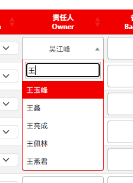

### 3.3 免检勾选框

点一下切换勾选状态。含义见 [§2](#2-先看懂这张表重要) 的说明。

### 3.4 改完之后

改过的单元格会**变黄底**，页面右上角显示「**待保存 N 项**」——这说明改动还只停在你的屏幕上，**没有进表格**。

> 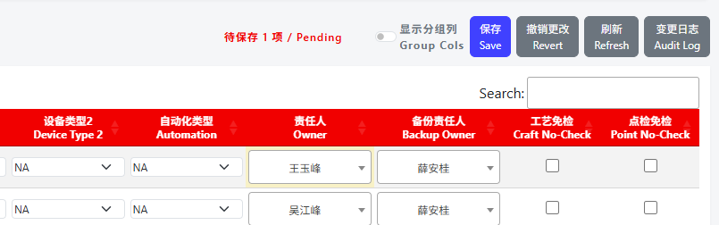

---

## 4. 保存

改动都做完后，点右上角「**保存**」：

> 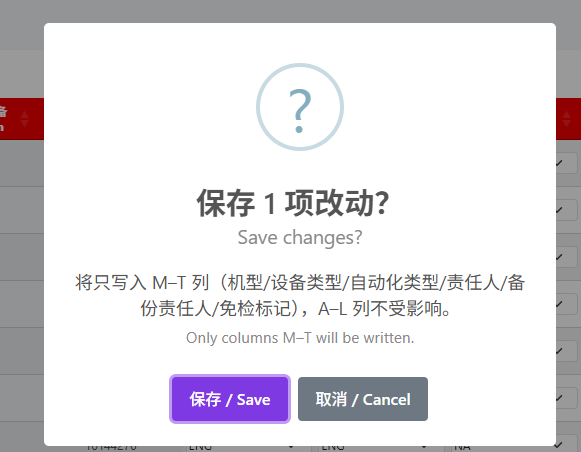

确认后会提示「已保存 N 项」，黄底消失，表格重新加载一遍最新数据。

**保存只会写你动过的那几格**：你没碰过的单元格，一个字都不会被改动——包括左边那些只读列，绝对安全。

---

## 5. 别人同时在改怎么办（冲突提醒）

这是这个页面最有用的一个保护。

**场景**：你在网页上打开维护页时，某台机的责任人显示为「吴江峰」。这时同事直接在 Google 表格里把它改成了「薛安桂」。你不知道，在网页上把同一台机改成了别人，然后点保存。

**结果**：系统会弹窗提示「**部分字段未保存**」，并列出是哪台机的哪一列：

```
E0EN0001 · 责任人：表中现值「薛安桂」≠ 提交旧值「吴江峰」（已被他人修改）
```

（"表中现值"就是表格里现在的值，"提交旧值"是页面打开时读到的值——两者不一致，说明这一格在你操作期间被别人改过。）

> 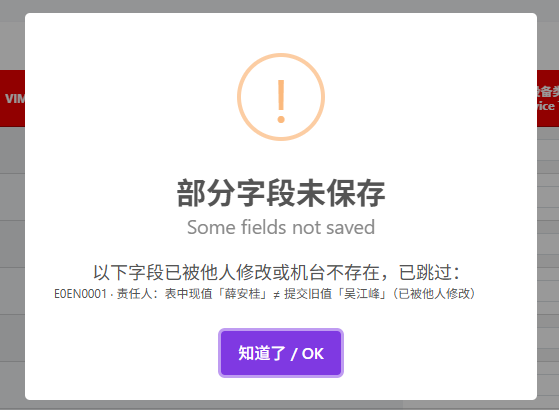

**意味着什么**：这一格**没有**被覆盖，别人的"张三"保住了。表格刷新后会显示"张三"，你可以看清楚现状再决定要不要改成"李四"。

**记住一句**：看到这个提示不是报错，是系统帮你避免把别人的修改踩掉。

---

## 6. 撤销、刷新、关页面

| 按钮 | 作用 |
|---|---|
| **撤销更改** | 把还没保存的改动全部还原成修改前的样子 |
| **刷新** | 重新从表格读取最新数据（有未保存改动时会先问你） |

**关页面时**：如果还有未保存的改动，浏览器会弹一个「确定要离开此网站吗」的提示。**看到这个提示就说明你有改动没保存**——可以先取消，回去点保存。

---

## 7. 看变更日志：谁在什么时候改了什么

点右上角「**变更日志**」按钮：

> 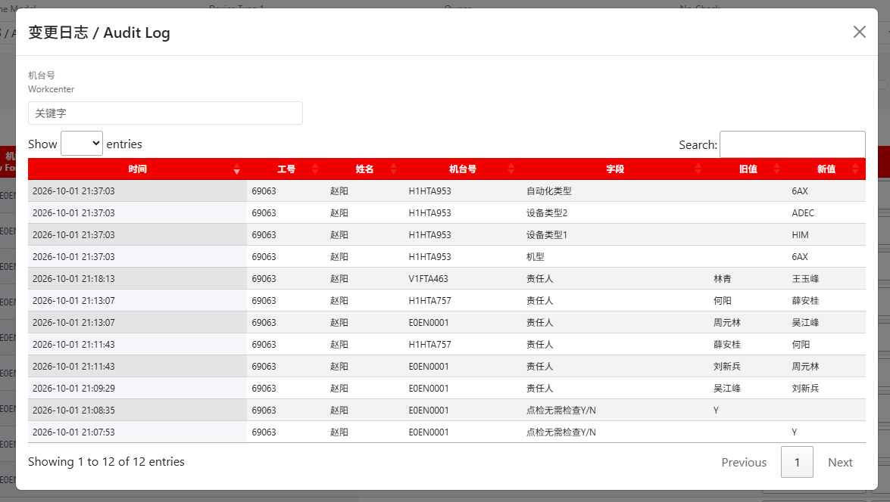

弹窗里列出最近 200 条修改记录，最新的在最上面，每条包含：**时间 / 工号 / 姓名 / 机台号 / 字段 / 旧值 / 新值**。

上面有个「机台号」输入框，输入机台号可以只看这台机的修改历史。

**用途**：出了问题时可以查"这台机的责任人什么时候被谁改的、改成什么了"。

---

## 8. 找机台、筛机台

页面上方一排筛选条件：

> 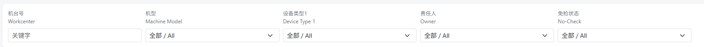

| 筛选项 | 说明 |
|---|---|
| 机台号 | 输入关键字，边打边筛 |
| 机型 | 按机型筛 |
| 设备类型1 | 按设备类型筛 |
| 责任人 | 只看某个人负责的机台 |
| 免检状态 | 「工艺免检」= 只看勾了工艺免检的；「点检免检」同理 |

**筛选条件在保存后依然有效**——比如你筛出"3AX 机型"改了几台，保存后还是只显示这几台。

---

## 9. 列太多看着累？用「显示分组列」开关

默认状态下，表格**隐藏了 6 个只读的中间列**（机器性能、HIM/Auto、VIM-1~4），这样剩下的 14 列都宽一些，看着清楚。

开关在工具栏右侧，默认是关的：

> 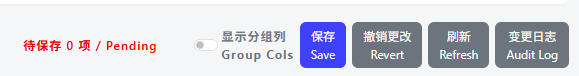

点一下，那 6 列回来，变成完整的 20 列：

> 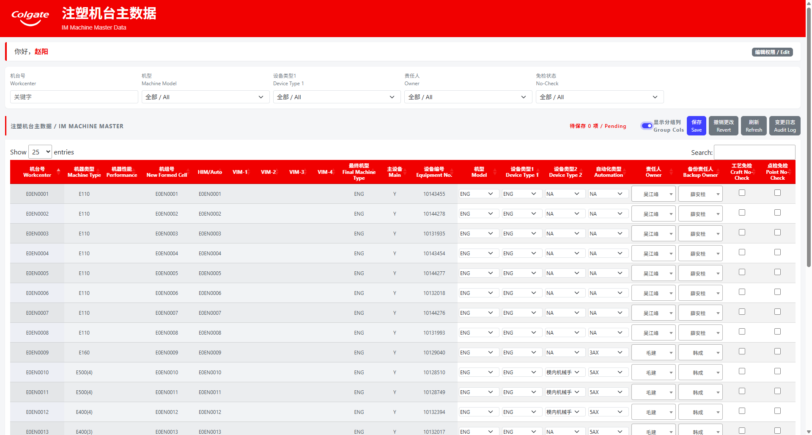

再点一下又收起来。开关状态在你**不关标签页**的情况下会一直保留——保存、刷新、撤销都不会把它弹回去。

---

## 10. 这些列为什么改不了

左边那些灰色列（机台号、机组号、最终机型、设备编号等）之所以锁住，是因为**别的模块正在用它们**：

| 列 | 谁在用 | 用来干什么 |
|---|---|---|
| 机台号 | NPI / 点检 / 故障报告 / EAM | 各处机台下拉的取值 |
| 机组号（New Formed Cell） | 点检 | RBM 机台分组 |
| 最终机型（Final Machine Type） | NPI / 故障报告 | 排除退役、闲置、报废机台 |
| 设备编号 | EAM | 查设备编号 |

**好消息**：正因为它们锁住了，你在本页面上**不可能误改到它们**。

**但要知道**：如果你确实需要改这几列，只能回到 Google 表格里改，而且**要想清楚**——改错了会直接影响到上面那几个模块（比如把最终机型改成 NA，这台机就会从 NPI 和故障报告的机台下拉里消失）。

---

## 11. 常见问题

**Q：为什么有些列点不动、改不了？**
A：左侧灰底列是只读对照列，见 [§10](#10-这些列为什么改不了)。

**Q：我想加一台新机台 / 删掉一台退役机台，在哪儿加？**
A：本页面**只能改、不能增删机台**。新增或删除机台请在 Google 表格的 Workcenter 表里操作（加行 / 改最终机型为 NA）。

**Q：下拉里没有我要选的值怎么办？**
A：
- **机型**：选项来自表格里的「机型选项」sheet，请去那个 sheet 里补一行，页面刷新后即可选用。
- **设备类型1 / 设备类型2 / 自动化类型**：选项来自保养任务清单的机型列表，不是在本页维护的。找不到就先留空白；**确认这台机确实不适用，选末尾的 `NA`**。
- **责任人 / 备份责任人**：只列出注塑工序的在册人员。如果是新人，需要先在人员信息表里补齐工序与职位。

**Q：保存时提示「部分字段未保存」是什么问题？**
A：不是报错，是冲突保护，见 [§5](#5-别人同时在改怎么办冲突提醒)。

**Q：我明明改了，为什么保存后表格里还是旧值？**
A：请看提示里列出的冲突明细——大概率是同一格已被别人改过，系统没有覆盖它。

**Q：免检那两列，为什么有的机台是勾、有的是空？**
A：勾代表该机台对应项目无需检查。空白代表需要正常检查。这是表格里原本就有的状态，页面如实显示。

**Q：改错了能改回来吗？**
A：能，重新选回原值再保存即可。想知道原值是什么，打开「变更日志」查"旧值"。

**Q：我改到一半下班了，改动会丢吗？**
A：没点保存的改动**不会**进表格，关掉页面就没了。走之前记得点保存。

---

## 12. 几条要记住的

1. **改完一定要点「保存」**，黄底和「待保存 N 项」就是提醒你还没保存。
2. **看到冲突提示不要慌**，那是系统在保护别人的修改，不是你的操作失败了。
3. **左边灰色列改不了是故意的**，要改得回表格改，而且要谨慎。
4. **改动都有留痕**，谁改的、什么时候改的、改前是什么，都能在「变更日志」里查到。
5. **免检勾选框**：勾 = 无需检查，取消勾选 = 留空（不是填 N）。

---

## 13. 版本记录

| 版本 | 日期 | 说明 |
|---|---|---|
| V20261001.01 | 2026-10-01 | 初版，覆盖入口、可改列范围、保存与冲突保护、变更日志、筛选、分组列开关 |
| V20261003.23 | 2026-10-03 | 入口补充登录要求：必须先登录 EDS；邮件链接先落登录页、登录后自动回到本页，未登录直达会看到「去登录」入口（不加载数据） |
| V20261009.27 | 2026-10-09 | 设备类型1 / 设备类型2 / 自动化类型三列下拉末尾新增固定选项 `NA`（不适用），顶部「设备类型1」筛选框同步可选 `NA` |
