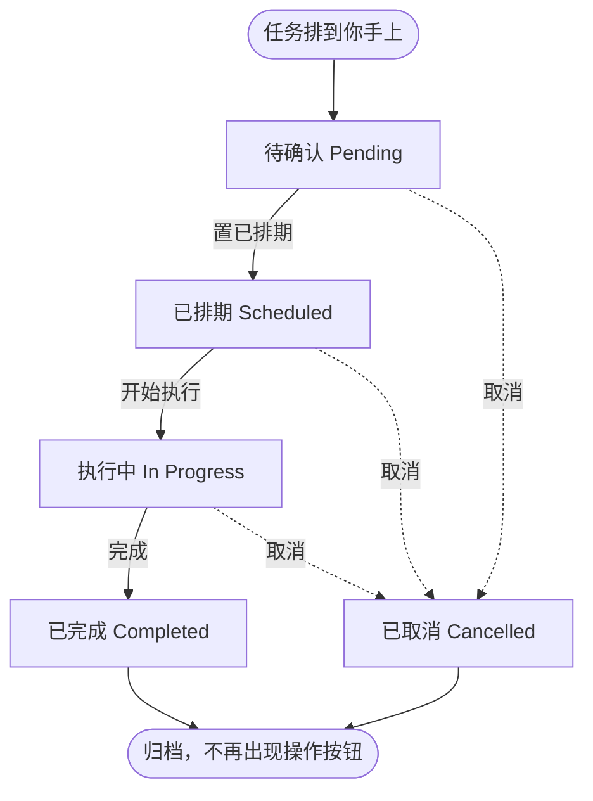

# 测试计划状态流转操作指导（测试组）

> **版本**：V20260930.01
> **适用系统**：EDS 设备数字化系统（Equipment Digital System）→ 测试计划 / Test Scheduling
> **适用对象**：测试组——任务排到你手上之后，由你推进并最终关闭的人
> **怎么用**：先看 [§1 一张图](#1-先看这张图一个测试任务的一生) 建立全貌，再按 [§3](#3-你要点的三个按钮) 照着点。遇到异常直接跳 [§7](#7-例外什么时候用取消)。

---

## 0. 目录

- [1. 先看这张图：一个测试任务的一生](#1-先看这张图一个测试任务的一生)
- [2. 五个状态分别是什么意思](#2-五个状态分别是什么意思)
- [3. 你要点的三个按钮](#3-你要点的三个按钮)
- [4. 执行期间必须做的：工艺参数](#4-执行期间必须做的工艺参数)
- [5. 什么时候算可以关闭](#5-什么时候算可以关闭)
- [6. 一直不关会怎样](#6-一直不关会怎样)
- [7. 例外：什么时候用「取消」](#7-例外什么时候用取消)
- [8. 易错点](#8-易错点)

---

## 1. 先看这张图：一个测试任务的一生

**两条要记住的规矩：**

1. **只能一步步往前走，不能跳步。** 从「待确认」直接点「完成」是点不到的——那个按钮只出现在「执行中」的行上。
2. **「已完成」和「已取消」是终点，进去了出不来。** 没有撤回按钮，系统里也没有任何界面能把终态改回去。

> 你在「测试计划」页看到的每一行就是一条测试任务。点行内任意位置（操作按钮除外）会跳到工艺参数页并自动选中这条任务。

---

## 2. 五个状态分别是什么意思

| 状态 | 含义 | 这时该做什么 |
|---|---|---|
| **待确认** Pending | 任务已录入，机台和日期还没锁定 | 确认机台/模具可用后点「置已排期」 |
| **已排期** Scheduled | 机台和日期已定，等着上机 | 到计划日期、准备上机时点「开始执行」 |
| **执行中** In Progress | 正在测试 | 边测边记工艺参数；测完点「完成」 |
| **已完成** Completed | 测试结束，任务关闭 | 无需操作（若工艺卡还没转正，见 §5） |
| **已取消** Cancelled | 测试取消，任务关闭 | 无需操作 |

**「活跃任务」**指前三个状态。机台冲突提示只看活跃任务——同机台同一天有 2 条以上活跃任务时，机台列会出现黄色「冲突」标，提醒你排期撞了。

---

## 3. 你要点的三个按钮

按钮都在**测试计划页**的「操作」列，只有对应状态的行才会出现。

### 3.1 置已排期 / Schedule

- **什么时候点**：确认这台机台、这个日期能上机之后。
- **点了之后**：状态从「待确认」变「已排期」。
- **有二次确认吗**：没有，点一下就生效。
- **注意**：这一步是把排期**确认下来**。但要知道——机台冲突检测把「待确认」也算作活跃任务，所以一条停在「待确认」没推进的任务**照样占用机台席位**，会跟别人撞出黄标。它不会因为「还没确认」就不占位置。

### 3.2 开始执行 / Start

- **什么时候点**：到达计划日期、实际开始上机测试时。
- **点了之后**：状态变「执行中」。
- **有二次确认吗**：没有。

### 3.3 完成 / Complete

- **什么时候点**：测试做完、工艺参数也处理完之后（见 §5）。
- **点了之后**：状态变「已完成」，任务关闭，这一行不再有任何操作按钮。
- **有二次确认吗**：**没有——这是最容易点错的地方。** 点了就是终态，没有撤回。点错了只能找管理员直接改后台表。

> **「取消」按钮有二次确认，但「完成」没有。** 这是系统现状，不是 bug。三个前进按钮都请看清楚再点。

---

## 4. 执行期间必须做的：工艺参数

测试过程中要记录工艺参数。入口有两个：在测试计划页**点任务行**跳转，或从导航进「工艺参数记录 / Process Record」再在下拉里选任务。

页面按钮分两类：

**主流程按钮**

| 按钮 | 作用 | 之后会怎样 |
|---|---|---|
| **保存草稿** Save Draft | 随时保存，可以反复存 | 状态「草稿」，表单仍可编辑 |
| **提交** Submit | 参数确认无误，正式提交 | 状态「已提交」，**表单变只读**，工艺卡版本号 +1 |
| **转正** Promote | 把测试工艺卡转成正式工艺卡 | 状态「已转正」，写入 PPMS 走复核流程 |
| **创建新版本** New Version | 提交后发现填错了，要改 | 生成一份新草稿，旧版本留在历史里 |

> 「转正」和「创建新版本」两个按钮在**提交之前不显示**——所以你刚打开页面看不到它们，是正常的。

**辅助按钮**

| 按钮 | 作用 | 注意 |
|---|---|---|
| **填测试数据** Fill Test Data | 一键把可编辑的数字字段填成示例值（按单位给 100 / 200 / 80 / 50 之类） | ⚠️ 填的是**假数据**，只适合快速试填。**绝不能拿它当真实参数提交** |
| **清空全部** Clear All | 清空表单上所有内容 | **不可撤销**，点之前会弹确认框。提交过的记录不会因此被改——它只清当前表单 |

**提交后不能直接改。** 需要修订就走「创建新版本」——系统会保留旧版本，历史记录里每个版本都能查看。这是有意的：工艺参数要留痕。

**转正不是必须马上做**，但见 §5——它是关闭任务的业务前提。同一个任务重复转正会被拦住，不会重复建卡。

---

## 5. 什么时候算可以关闭

关闭前请把这张表过一遍。**注意「谁强制」这一列**——系统不拦的不代表不用做。

| 检查项 | 在哪看 | 谁强制 |
|---|---|---|
| 任务状态是「执行中」 | 测试计划页 → 状态列 | ✅ **系统强制**（否则不显示「完成」按钮） |
| 工艺参数已**提交**（不是草稿） | 测试计划页 → 工艺卡列，蓝色「已提交」徽章 | ⚠️ 业务要求，系统不拦 |
| 工艺卡已**转正** | 同上，绿色「已转正」徽章 | ⚠️ 业务要求，系统不拦 |
| 机台冲突已消除 | 测试计划页 → 机台列黄标 | 提示性 |

**工艺卡列的三色徽章**：灰色「草稿」/ 蓝色「已提交」/ 绿色「已转正」。**整行标红**表示这条任务还没有工艺卡（紧急任务也会标红）。

> 系统只在状态机上把关，不会因为你工艺卡还是草稿就拦住「完成」。所以这三条里，只有第一条是系统替你兜底的，后两条要靠自己守。

---

## 6. 一直不关会怎样

任务迟迟不关闭，会以三种方式反过来找你：

**1. 行标红** — 没有工艺卡的任务在测试计划页整行标红，所有人可见。

**2. EDS 里显示「已超期」** — 状态不是「已完成」「已取消」、且计划日期已过的任务，在任务列表、今日看板、我的任务、资源甘特这四个入口里会被自动标成「已超期」。

**3. 每天早上的邮件** — 超期未关闭的**注塑（IM）任务**会进「早会日报」的 B 类超期清单，每天早上 **07:45** 自动发给相关主管和责任人，邮件标题形如 `【EDS人员工作安排 & 任务完成情况】2026-09-30`。清单里会列出任务编号、标题（形如 `NPI: 机台号 - 产品名称`）、负责人、截止日期和超期天数，按超期天数从多到少排。

> 植毛/包装（TF/PK）的超期任务目前不进这封邮件——只有注塑任务参与汇总。

所以：**测试做完当天就关掉**，别拖。拖着不关，超期天数每天涨，主管每天早上都会在邮件里看到。

---

## 7. 例外：什么时候用「取消」

「取消」在任意未完成状态下都能点，**有二次确认弹窗**（系统会提示「取消后为终态」）。

**适用场景**：测试取消、模具或机台不可用、重复排期。

**点了之后**：状态变「已取消」，任务关闭，不再计入活跃任务——机台冲突检测会忽略它，也不会再进超期清单。

**三个必须知道的点：**

1. **取消 ≠ 删除。** 任务仍在系统里、仍能在 EDS 各入口看到，只是状态是「已取消」。数据是留痕的。
2. **取消和已完成一样是终态，不可逆。**
3. **「取消」不删除任何数据**——工艺参数记录原样保留。而且工艺卡已转正的任务**根本删不掉**，系统会明确报错。

---

## 8. 易错点

| 易错点 | 后果 | 怎么避免 |
|---|---|---|
| **「完成」没有二次确认，手快点错** | 任务直接进终态，只能找管理员改后台表 | 点「完成」前先看清是哪一行 |
| 任务卡在「待确认」没人推 | 它照样占用机台席位、照样计入超期，早晚进日报邮件 | 排期确认后当天就点「置已排期」 |
| 流程跳着想点「完成」 | 按钮根本不出现 | 记住只能一步步走：置已排期 → 开始执行 → 完成 |
| 提交工艺参数后想直接改 | 表单只读，改不动 | 用「创建新版本」，旧版本会保留 |
| 以为没转正就关不掉 | —— | 互不影响：系统不拦。但转正是业务要求，别漏 |
| 想「先把任务删了重来」 | 已转正的任务删不掉 | 用「取消」表达测试作废，不要试图删除 |

---

## 附：常见问题

**Q：我在测试计划页找不到某条任务？**
按周筛选或状态筛选挡住了。把筛选器清空再看看。

**Q：状态点错了能撤回吗？**
「已完成」「已取消」两个终态不能撤回，需要联系管理员直接改后台表。往前推的那几步同样没有回退按钮——但任务还在，可以继续往下走（或取消）。

**Q：为什么这行是红的？**
两种原因：没有工艺卡，或者是紧急任务。两者都会整行标红。

**Q：机台列的黄色「冲突」是什么意思？**
同一台机台、同一天，有 2 条以上的活跃任务。可能是排期撞了，需要协调。

**Q：任务在 EDS 别的页面（任务列表/今日看板/我的任务）里能看到，能在那儿改状态吗？**
不能。EDS 其他入口对测试任务**只读**，点进去会跳到工艺参数页。要改状态回测试计划页。

---

## 版本记录

| 版本 | 日期 | 说明 |
|---|---|---|
| V20260930.01 | 2026-09-30 | 初版，覆盖五态流转、工艺参数、关闭条件、超期后果、取消例外 |
