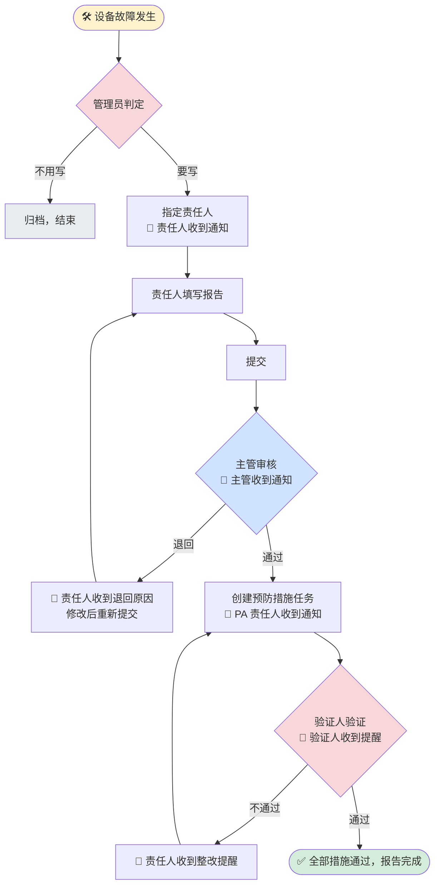

# EDS 故障报告操作手册

> **版本**：V20260615.01
> **适用系统**：EDS 设备数字化系统（Equipment Digital System）
> **怎么用这本手册**：先看 [§2 整体流程](#2-一份故障报告的一生整体流程) 了解全貌，然后**直接跳到"你是谁"对应的章节**看你要做的操作。

---

## 0. 目录

- [1. 这个模块能帮你做什么](#1-这个模块能帮你做什么)
- [2. 一份故障报告的一生（整体流程）](#2-一份故障报告的一生整体流程)
- [3. 进入故障报告模块](#3-进入故障报告模块)
- [4. 我是管理员：判定与分配](#4-我是管理员判定与分配)
- [5. 我是责任人：填写并提交报告](#5-我是责任人填写并提交报告)
- [6. 我是审核人：审核报告](#6-我是审核人审核报告)
- [7. 我是 PA 责任人：跟进措施](#7-我是-pa-责任人跟进措施)
- [8. 我是验证人：验证效果](#8-我是验证人验证效果)
- [9. 谁都能用：查看进度](#9-谁都能用查看进度)
- [10. 你会收到哪些邮件](#10-你会收到哪些邮件)
- [11. 常见问题](#11-常见问题)
- [12. 几条要记住的提醒](#12-几条要记住的提醒)
- [13. 版本记录](#13-版本记录)

---

## 1. 这个模块能帮你做什么

设备出现故障后，故障报告模块带着你一步步完成：**判定要不要写报告 → 填写报告 → 主管审核 → 跟进预防措施 → 验证效果 → 关闭**。

不同岗位用到的功能不一样，对号入座即可：

| 你的角色 | 你主要做什么 | 看哪一章 |
|---|---|---|
| 管理员 | 判定故障要不要写报告、指定谁来写 | [§4](#4-我是管理员判定与分配) |
| 报告责任人 | 填写故障报告并提交 | [§5](#5-我是责任人填写并提交报告) |
| 审核人（主管/管理员） | 审核报告内容，通过或退回 | [§6](#6-我是审核人审核报告) |
| PA 责任人 | 落实预防措施，填写完成情况 | [§7](#7-我是-pa-责任人跟进措施) |
| 验证人 | 检查措施是否到位 | [§8](#8-我是验证人验证效果) |
| 所有人 | 看报告进度 | [§9](#9-谁都能用查看进度) |

> 你能看到哪些操作按钮，系统会**根据你的岗位自动判断**，不用你设置。

---

## 2. 一份故障报告的一生（整体流程）

**最容易踩坑的两点，先记住**：

1. **「提交」不等于「完成」**。你提交报告后，要等主管**审核通过**，报告才正式生效。审核期间你改不了，只有被退回才能再改。
2. **会自动发邮件**。每个环节流转到下一个人，系统都会发邮件提醒，不用你手动通知（少数地方有手动提醒按钮，见各章）。

---

## 3. 进入故障报告模块

1. 打开 EDS 系统首页。
2. 在 **故障与改善 / Fault & Improvement** 分组下，点击橙色的 **故障报告 / Failure Report** 卡片。
3. 弹出菜单，选你要用的功能：

| 菜单 | 干什么 |
|---|---|
| 📋 **故障报告管理** | 判定要不要写报告、指定责任人（管理员用） |
| ✏️ **故障报告填写** | 填写并提交报告（责任人用） |
| ✅ **故障报告审核** | 审核报告（主管/管理员用） |
| ☑️ **故障报告跟进验证** | 跟进措施 + 验证效果 |
| 📊 **故障报告进度** | 查看所有报告进度 |

> 
> 

> 点「故障报告跟进验证」后，系统会按你的身份自动带你去**跟进页**（你是 PA 责任人）或**验证页**（你是验证人）。

---

## 4. 我是管理员：判定与分配

### 4.1 你要做的事

设备故障记录进来后，由你判断**要不要写正式故障报告**，要写的话**指定谁来写**。

### 4.2 怎么操作

1. 进入 **故障报告管理**。
2. 顶部切换工序页签：**注塑 IM / 植磨毛 TF / 包装 PK**。
3. 在列表里找到那条故障（默认最新的在最上面）。

> 

**判定参考阈值**（页面顶部黄色芯片也有显示）：

| 工序 | 故障时长超过 |
|---|---|
| 注塑 IM | 240 分钟 |
| 植磨毛 TF | 120 分钟 |
| 包装 PK | 60 分钟 |

> 阈值只是参考。涉及安全、质量、客诉等情况，即使时长没到也可以要求写报告。

#### 要写报告

1. 在 **责任人** 那一列点开下拉，选择负责填写的人（也可以直接打字输入姓名）。
2. 点 **需要故障报告 / Need Failure Report**。
3. 弹窗确认 → **确定**。
4. 这条记录从列表消失，系统**自动给责任人发邮件**，要求 3 天内填写。

> 

> ⚠️ **必须先选责任人**，否则会提示「请先分配责任人」。

#### 不用写报告

找到记录 → 点 **不需要故障报告 / No Failure Report** → 确认。记录归档，从列表消失。

### 4.3 手动补一条故障记录

现场有漏报、旧记录没进列表？点右上角 **➕ 手动添加**：

1. 列表顶部出现一行**黄色高亮**的空行。
2. 填好：维修时间（只能填数字）、提交日期、责任人、工序、问题描述、机台号、状态、车间。
3. 点「需要 / 不需要故障报告」完成判定。

> 

> 手动添加的行永远排在最上面，方便你一次处理多条，不用翻页找。

### 4.4 换人填报告

原责任人休假、调岗写不了？你可以在 **故障报告填写** 列表里把报告**重新指派**给别人。

---

## 5. 我是责任人：填写并提交报告

### 5.1 你要做的事

收到"请填写故障报告"的邮件后，进系统填写 **Breakdown Analysis（故障分析报告）** 并提交。请在收到通知后 **3 天内** 完成。

### 5.2 找到你的报告

1. 进入 **故障报告填写**。
2. 切换工序页签，找到分配给你的报告。看 **状态** 列决定怎么做：

| 状态 | 含义 | 你点什么 |
|---|---|---|
| 未提交 | 还没填过 | **填写故障报告** |
| 已退回 | 被主管退回了（会显示退回原因） | **修改 / Edit** |
| 审核中 | 已提交，等主管审核 | 按钮置灰，**这时改不了**，等结果 |

### 5.3 填写表单

点进去后，按区域填写：

> 

| 区域 | 填什么 | 小提示 |
|---|---|---|
| 基本信息 | 机台号、状态、报告编号、**分析人员**、故障时长 | **故障时长不用填**，系统自动带入、改不了；**分析人员默认已填你自己**，可加别人 |
| 维修前故障现象 | 照片、发生了什么、时间、地点、发现人、描述 | 照片建议现场拍清楚 |
| 行动措施描述 | 维修过程、**处理人（Who）**、日期、耗时、结果 | **处理人默认已填你自己**，可加别人 |
| RCA 根因分析 | 5 个 Why，逐层追问根本原因 | 见下方说明 |
| 纠正预防措施（CAPA） | 类型、问题根因、预防行动、责任人、计划日期、验证人、验证日期 | 见下方说明 |

#### RCA 根因分析怎么填

- 表格分 **管理系统** 和 **技术系统** 两类列，各有 `＋` / `－` 按钮，可以**加列或删列**（至少保留 1 列）。
- 纵向固定 5 行（Why1~Why5），从现象一层层往下问"为什么"。
- 表格最下面一行 **根本原因**，每列选一个：**人 / 机 / 料 / 法 / 环**。

#### CAPA 纠正预防措施怎么填

每条措施一行，填：

- **类型**：SWI / SOP / AM / PM / Kaizen / 纠正措施。
- **问题根因**：下拉里会自动列出你在 RCA 里选过的根因（如"管理系统① - 人"），选对应的那个。
- **预防行动、责任人、计划完成日期、验证人、验证日期**。

> 日期限制：计划完成日期不能选过去；验证日期不能早于计划完成日期。
> ⚠️ 如果你在 RCA 里删了某一列，CAPA 里引用它的"问题根因"会被清空，记得重新选。

### 5.4 先存草稿，回头再填

填一半信息不全、等照片、要先走开？点 **保存草稿 / Save Draft**，下次回来接着填。
要重头来过，点 **清除草稿 / Clear Draft**。

> 草稿只是暂存，**最后一定要点「提交」报告才会真正送出去**。

### 5.5 提交

1. 确认必填项都填了，**至少有一条完整的 CAPA**（预防行动、责任人、计划日期、验证人、验证日期都填齐）。
2. 点 **提交 / Submit** → 确认。
3. 提交后报告进入 **审核中**，系统**自动通知主管审核**。

> ⚠️ 提交后你就改不了了，请提交前检查清楚。如果有必填没填，会弹"必填项未完成"提示你补。

### 5.6 报告被退回了怎么办

主管退回后，你会收到**带退回原因的邮件**，报告在填写列表里显示 **已退回**：

1. 点 **修改 / Edit**，原内容会自动回填。
2. 按退回原因修改。
3. 重新 **提交**，又回到审核中等主管再看。

> 可以来回退回-修改很多次，不限次数；审核你的还是同一个主管。

---

## 6. 我是审核人：审核报告

### 6.1 你要做的事

责任人提交后，由你（直线主管，或本工序管理员）审核报告的根因分析和措施是否到位，**通过**或**退回**。

### 6.2 怎么操作

1. 进入 **故障报告审核**。

> 没有审核权限的人进来会看到"您暂无审核权限"。你能看到的是**你下属**（你是主管）或**你这个工序**（你是管理员）需要审核的报告。

2. 列表里默认是**待审核**和**已退回**的报告，可按工序筛选。状态颜色：黄=审核中、绿=已通过、红=已退回。
3. 对每条报告：

| 按钮 | 作用 |
|---|---|
| **查看详情 / View Detail** | 弹窗看完整报告内容（只读） |
| **通过 / Approve** | 弹窗确认后通过 |
| **退回 / Return** | 弹窗里填退回原因（可不填）后退回 |

### 6.3 通过之后会发生什么

- 系统生成正式 PDF 报告并存档；
- 自动创建预防措施（PA）跟进任务；
- **自动通知 PA 责任人**去跟进（抄送你和验证人）。

### 6.4 退回之后会发生什么

- 系统**把退回原因邮件发给责任人**（抄送你）；
- 报告回到责任人的填写列表，他改完会再次提交给你审。

> 建议退回时写清楚原因，责任人改起来更有方向。

---

## 7. 我是 PA 责任人：跟进措施

### 7.1 你要做的事

报告审核通过后，里面的每条预防措施会变成一个**跟进任务**派给你。你落实措施后，把实际完成情况填进去。

### 7.2 怎么操作

1. 进入 **故障报告跟进验证**（系统会自动带你到跟进页）。
2. 在 **我的跟进任务** 里找到任务。
3. 在 **跟进内容 / Follow-up Content** 写实际处理情况，建议写清：
   - 做了什么（如"已更换损坏传感器并重新固定线缆"）
   - 完成证据（如"试机 30 分钟无异常"）
   - 遗留问题（如"后续一周观察"）
4. 点 **保存 / Save**。
5. 完成后可点 **📧 邮件提醒验证人**，催验证人来验。

### 7.3 措施被验证不通过

验证人验不通过时你会收到整改提醒邮件。更新跟进内容后，等验证人再验一次。

---

## 8. 我是验证人：验证效果

### 8.1 你要做的事

检查 PA 责任人落实的措施是否真的完成、有没有效果，给出验证结论。

### 8.2 怎么操作

1. 进入 **故障报告跟进验证**（系统会自动带你到验证页）。
2. 在 **我的验证任务** 里找到记录，可查看报告 PDF 和措施内容。
3. 在 **状态 / Status** 选结论：

| 选项 | 含义 |
|---|---|
| 已通过 / Passed | 措施有效，这条关闭 |
| 未通过 / Not Passed | 不到位，要责任人整改 |
| 未验证 / Not Verified | 重置为待验证 |

4. 在 **验证回复 / Verification Reply** 写你的意见（不写也行）。
5. 点 **保存 / Save**。

> 

> ⚠️ **一点保存，系统就会给 PA 责任人发邮件**（抄送你），三种结论都会发：通过=确认、不通过=要整改、未验证=提醒重做。所以不想发通知就先别保存。

### 8.3 验证不通过时

在验证回复里写明原因 → 保存（责任人自动收到整改邮件）→ 责任人改完 → 你再验一次。

---

## 9. 谁都能用：查看进度

### 9.1 你要做的事

想知道某份报告走到哪一步、措施验证了几条，进 **故障报告进度**。

### 9.2 你能看到什么

> 还在"审核中/已退回"的报告不在这里（它们还在审核环节）。

| 列 | 看什么 |
|---|---|
| 报告编号 / 机台号 / 工序 / 问题描述 | 基本信息 |
| 分配日期 / 上传日期 | 上传日期 = 主管审核通过的那天 |
| 完成天数 | 从分配到通过用了几天，**超期会标红/橙** |
| **验证进度** | 比如 `2 / 3`，表示 3 条措施已通过 2 条 |
| **状态** | 见下表 |
| 附件 | 报告 PDF |

**状态三色**：

| 状态 | 含义 | 颜色 |
|---|---|:---:|
| 未上传 | 还没生成报告附件 | 🔴 红 |
| 已上传 | 有报告了，但措施还没全通过 | 🟡 黄 |
| 已完成 | 报告 + 所有措施都通过了 | 🟢 绿 |

---

## 10. 你会收到哪些邮件

系统在这些时候自动发邮件，**不用谁手动通知**：

| 什么时候 | 谁会收到 |
|---|---|
| 管理员判定"需要报告" | 报告责任人（要求 3 天内填） |
| 责任人提交报告 | 主管 / 管理员（去审核） |
| 主管审核通过 | PA 责任人（去跟进） |
| 主管退回 | 报告责任人（附退回原因） |
| 责任人点"提醒验证人" | 验证人 |
| 验证人保存验证结论 | PA 责任人（通过/不通过/未验证都发） |

> 邮件里不带页面链接，请通过系统首页的菜单进入对应页面操作。

---

## 11. 常见问题

| 现象 | 为什么 | 怎么办 |
|---|---|---|
| 提交后没看到 PDF | 还在"审核中"，PDF 等审核通过才生成 | 等主管审核通过 |
| 提交后想改改不了 | 审核期间不让改，防重复提交 | 等主管退回后才能改 |
| 审核页看不到要审的报告 | 你不是这工序的管理员、也不是责任人的主管 | 找设备管理员确认你的岗位设置 |
| 进度页找不到某报告 | 它还在"审核中/已退回" | 审核通过后才会出现在进度页 |
| 点"需要故障报告"没反应 | 没选责任人 | 先在责任人列选人 |
| 报告提交不了 | 没有一条填齐的 CAPA | 至少完整填一条措施（5 个关键字段都填） |
| CAPA"问题根因"下拉是空的 | RCA 里还没选根本原因 | 先在 RCA 底部选"人/机/料/法/环" |
| CAPA"问题根因"突然空了 | 它对应的 RCA 列被删了 | 重新选一个问题根因 |
| 故障时长填不进去 | 设计就是自动带入、只读 | 要改的话改源头的维修时间 |
| 验证人一保存责任人就收到邮件 | 设计如此，三种结论都发 | 正常，先想好再保存 |
| 看不到"手动添加"按钮 | 你不是管理员 | 联系管理员 |
| 责任人下拉里没有要找的人 | 那个人不在系统名单里 | 直接在框里打字输入姓名 |

---

## 12. 几条要记住的提醒

1. 判定"需要报告"前，**一定先选责任人**。
2. 收到填报告通知，**3 天内**填完提交。
3. **提交不等于完成**，要等主管审核通过报告才生效。
4. 审核期间改不了报告，**被退回才能改**。
5. 每份报告**至少一条填齐的预防措施**。
6. 故障时长、报告编号这些灰色字段是自动带的，不用也不能改。
7. 验证不通过时，**在验证回复里写清原因**，方便责任人整改。
8. 验证人**一保存就会发邮件**给责任人，三种结论都发。

---

## 13. 版本记录

| 版本 | 日期 | 说明 |
|---|---|---|
| V20260519.01 | 2026-05-19 | 第一版 |
| V20260521.01 | 2026-05-21 | 新增责任人二次分配说明 |
| V20260527.01 | 2026-05-27 | 同步页面 UI 重设计 |
| **V20260615.01** | **2026-06-15** | **按角色任务全面重写**：新增「主管审核」环节；填写表单新增故障时长自动带入、分析人/处理人预填、RCA 动态列、CAPA 类型+问题根因；验证新增"验证回复"且保存即发邮件；进度新增"验证进度"和状态三色；菜单更新为 5 项 |

---

## 附录：建议补充的截图

本版本新增功能可补采以下截图放入 `docs/screenshots/`：

| 文件名 | 拍哪里 |
|---|---|
| `13-审核页-列表与操作.png` | 故障报告审核页（通过/退回按钮） |
| `14-审核-查看详情弹窗.png` | 「查看详情」只读报告弹窗 |
| `15-审核-退回原因弹窗.png` | 「退回」填原因的弹窗 |
| `16-填写列表-审核中状态.png` | 填写列表里"审核中/已退回"状态 |
| `17-RCA-动态列表格.png` | RCA 管理/技术系统动态列 + 根本原因行 |
| `18-CAPA-类型与问题根因.png` | CAPA 的"类型""问题根因"下拉 |
| `19-进度页-验证进度与三态.png` | 进度页验证进度列 + 状态三色 |
| `20-验证页-验证回复列.png` | 验证页"验证回复"列 |
