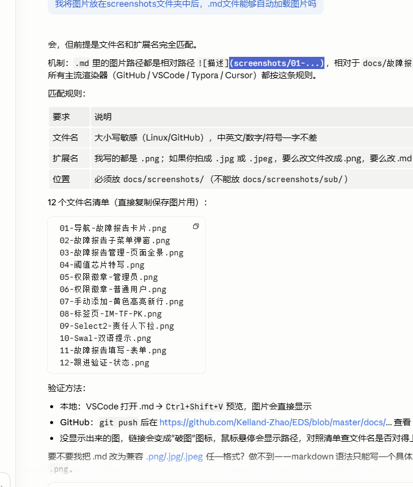
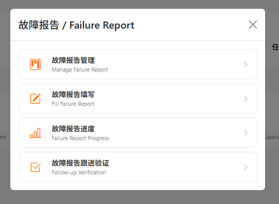
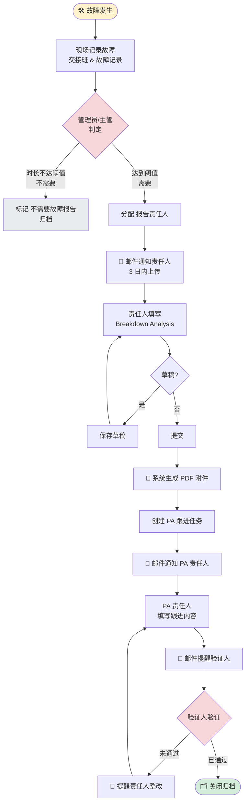
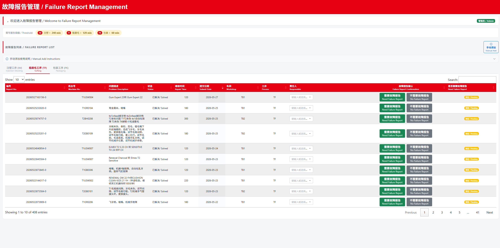
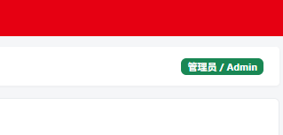
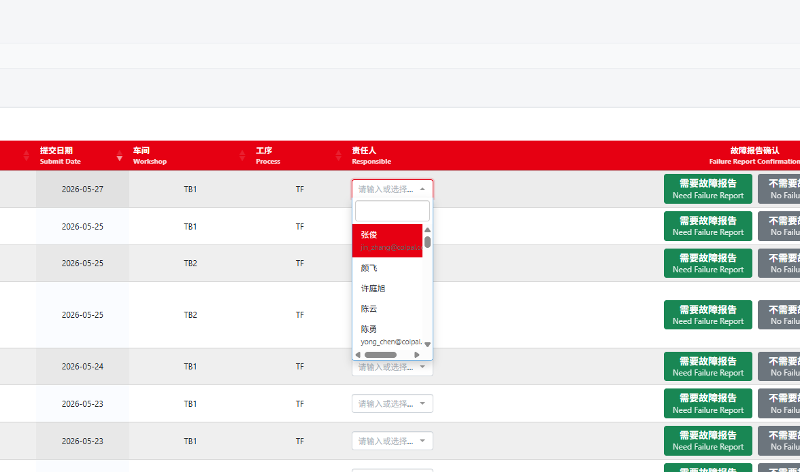
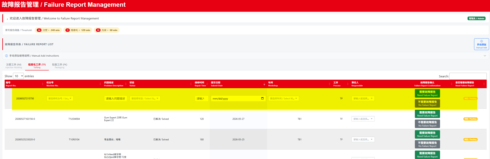
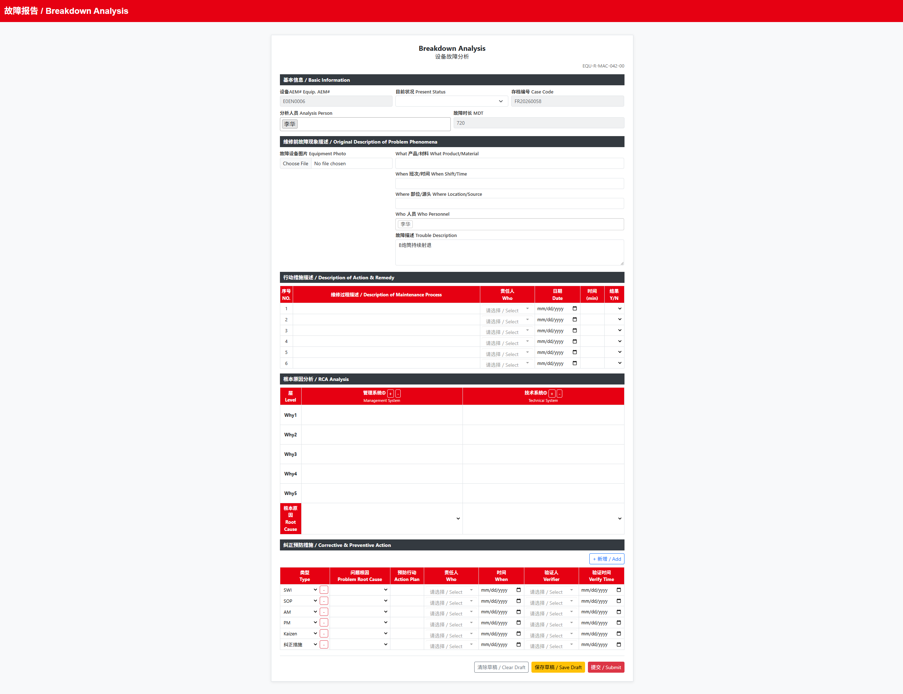
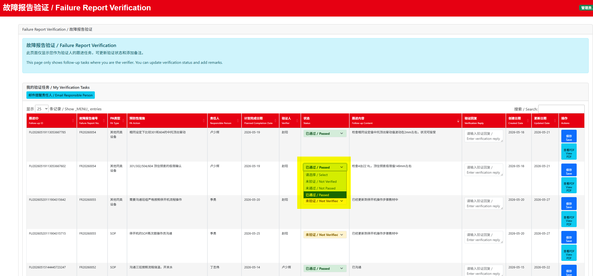
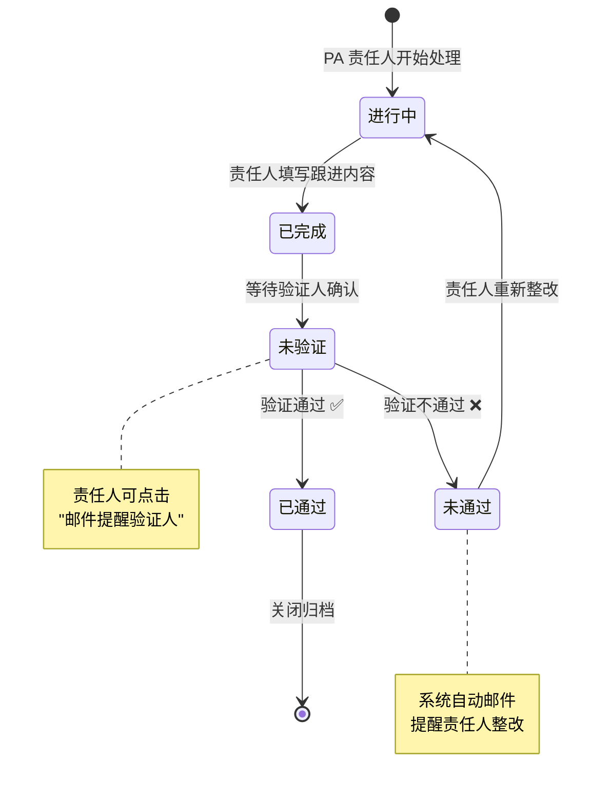

# EDS 故障报告操作手册

> **版本**：V20260527.01
> **适用系统**：EDS 设备管理系统（Equipment Digital System）
> **适用对象**：设备管理人员、维修人员、报告责任人、PA 责任人、验证人、主管
> **最近更新**：2026-05-27（同步 Navigation / FailureReport_Manage UI 重设计）

---

## 0. 目录

- [1. 功能说明](#1-功能说明)
- [2. 进入故障报告模块](#2-进入故障报告模块)
- [3. 故障报告整体流程](#3-故障报告整体流程)
- [4. 故障报告管理](#4-故障报告管理)
- [5. 故障报告填写](#5-故障报告填写)
- [6. 查看已上传附件](#6-查看已上传附件)
- [7. 故障报告查阅](#7-故障报告查阅)
- [8. 故障报告进度](#8-故障报告进度)
- [9. 故障报告跟进](#9-故障报告跟进)
- [10. 故障报告验证](#10-故障报告验证)
- [11. 邮件提醒](#11-邮件提醒)
- [12. 角色职责与流转](#12-角色职责与流转)
- [13. PA 状态机](#13-pa-状态机)
- [14. 常见问题](#14-常见问题)
- [15. 操作注意事项](#15-操作注意事项)
- [16. 界面规范一致性](#16-界面规范一致性)
- [17. 版本记录](#17-版本记录)

---

## 1. 功能说明

故障报告模块用于管理设备故障报告的**确认、填写、上传、查阅、进度跟踪和后续预防措施跟进**。

| 功能 | 用途 | 主要使用人 |
|---|---|---|
| 故障报告管理 | 判断故障记录是否需要填写故障报告，并分配责任人 | 管理员、主管 |
| 故障报告填写 | 填写 Breakdown Analysis，提交后生成 PDF 并保存附件 | 报告责任人、维修人员 |
| 故障报告查阅 | 查看已生成的故障报告记录和附件 | 所有授权用户 |
| 故障报告进度 | 跟踪报告分配日期、上传日期、完成天数和附件状态 | 管理员、主管 |
| 故障报告跟进 | 责任人填写预防措施跟进内容 | PA 责任人 |
| 故障报告验证 | 验证人确认跟进措施是否通过 | 验证人 |

---

## 2. 进入故障报告模块

### 2.1 操作步骤

1. 打开 EDS 系统首页（**导航页 / Navigation Page**）。
2. 在 **故障与改善 / Fault & Improvement** 分组下点击 **故障报告 / Failure Report** 卡片（橙色图标）。
3. 在弹出的**模态框**中选择需要的子功能。

> 
> *导航页"故障与改善"分组下的故障报告卡片（橙色 `bi-exclamation-triangle` 图标）*

### 2.2 子功能菜单

新版模态框使用**卡片式子按钮**：左侧图标 + 中文加粗 + 英文小灰字 + 右侧 chevron 箭头。鼠标悬停时按钮边框变红、向右平移 2px。

| 图标 | 子菜单 | 说明 |
|---|---|---|
| 📋 `bi-kanban` | **故障报告管理** / Manage Failure Report | 确认是否需要故障报告，分配责任人 |
| ✏️ `bi-pencil-square` | **故障报告填写** / Fill Failure Report | 填写并提交故障报告 |
| 📊 `bi-bar-chart-line` | **故障报告进度** / Failure Report Progress | 跟踪报告完成进度（管理员视角） |
| ✅ `bi-check2-square` | **故障报告跟进验证** / Follow-up Verification | 查看、跟进和验证 PA 项目 |

> 
> *卡片式子按钮（图标 + 双语 + 箭头）*

---

## 3. 故障报告整体流程

下图展示一次故障从发生到关闭的完整业务流。



### 3.1 关键时间节点

| 节点 | 标识字段 | 备注 |
|---|---|---|
| 故障发生 | （维修记录提交日期） | — |
| 报告分配 | `分配日期` | 管理员点击"需要故障报告"瞬间 |
| 报告上传 | `上传日期` | 报告责任人点击"提交"瞬间 |
| 完成天数 | `完成天数 = 上传日期 - 分配日期` | **超过 7 天会被醒目颜色标识** |

---

## 4. 故障报告管理

### 4.1 使用场景

当系统中出现待确认的故障记录时，管理员/主管在此页面**判断是否需要正式故障报告**并**分配责任人**。

### 4.2 页面位置

`故障报告 / Failure Report` → `故障报告管理 / Manage Failure Report`

### 4.3 页面布局（V20260527.01 重设计）

> 
> *页面从上到下：navbar / 欢迎条 / 阈值芯片 / 列表分组标题 / 工序标签页 / 数据表格*

| 区域 | 说明 |
|---|---|
| **navbar** | 红底白字，显示"故障报告管理 / Failure Report Management" |
| **欢迎条** | 红色左边框白底，左侧显示当前用户姓名 + 欢迎语，右侧显示权限徽章 |
| **阈值芯片** | 黄色芯片显示 IM / TF / PK 三个工序的故障时间阈值 |
| **分组标题** | 红色左边框，"故障报告列表 / FAILURE REPORT LIST" + 右侧"手动添加"按钮 |
| **折叠提示** | 灰底"手动添加使用说明"，默认收起 |
| **工序标签页** | 红色下划线高亮（IM / TF / PK），中文上 / 英文下 |
| **数据表格** | 红底白字表头 sticky 置顶，斑马纹隔行变色 |

### 4.4 故障时间阈值规则

故障时间达到下列阈值的记录**原则上**需要书写故障报告：

| 芯片 | 工序 | 故障时长阈值 |
|:---:|---|:---:|
| 🟠 IM | 注塑 Injection Molding | **> 240 min** |
| 🟠 TF | 植磨毛 Tufting | **> 120 min** |
| 🟠 PK | 包装 Packaging | **> 60 min** |

> 
> *页面顶部黄色芯片，3 个工序阈值一行展示*

阈值仅为**判定参考**——管理员可根据故障性质（安全/质量风险、客诉等）判断是否需要报告，**不局限于时长**。

### 4.5 权限说明

页面行为依用户在 EDS 系统的角色而异：

| 权限 | 徽章颜色 | "手动添加"按钮 | "需要 / 不需要"按钮 | 无权限提示 |
|---|:---:|:---:|:---:|---|
| 管理员 / Admin | 🟢 绿色 | ✅ 可见 | ✅ 可点击 | — |
| 普通用户 / User | 🟡 黄色 | ❌ 隐藏 | ❌ 不可见 | 显示"无操作权限，请联系管理员" |

> 
> 

### 4.6 页面字段

| 字段 | 说明 |
|---|---|
| 编号 | 原始故障记录编号 |
| 机台号 | 故障设备编号 |
| 问题描述 | 故障现象或问题说明（**左对齐**显示，其余列居中） |
| 状态 | 当前故障状态（进行中 / 已完成） |
| 维修时间 | 维修耗时（分钟，仅数字） |
| 提交日期 | 故障记录提交日期（**默认降序**：最新在前） |
| 车间 | 所属车间 |
| 工序 | 所属工序，如 IM、TF、PK |
| 责任人 | 故障报告填写责任人（Select2 下拉，支持自由输入兜底） |
| 故障报告确认 | 操作按钮 `[需要故障报告] [不需要故障报告]` |
| 是否需要故障报告 | 当前确认结果（已判定的行不再出现在本页） |

### 4.7 确认 — 需要故障报告

1. 进入 `故障报告管理` 页面。
2. 切换到对应工序页签：`注塑(IM) / 植磨毛(TF) / 包装(PK)`。
3. 找到目标故障记录（按"提交日期降序"，**最新在最上面**）。
4. 在 **责任人** 列点击下拉，输入或选择责任人；下拉项显示**姓名 + 邮箱（小灰字）**。
5. 点击 **需要故障报告 / Need Failure Report**。
6. 双语确认弹窗 `确认操作 / Confirm Action` → 点击 **确定 / Confirm**。
7. 系统保存后，该记录**消失**于本页（已判定），同时：
   - 进入 `故障报告填写` 列表
   - 给责任人发送邮件通知

> 
> *责任人列 Select2：聚焦边框红色，下拉项显示姓名 + 邮箱*

> ⚠️ **重要**：选择"需要故障报告"前**必须先分配责任人**。否则系统弹出双语警告"请先分配责任人 / Assign Responsible"。

### 4.8 确认 — 不需要故障报告

1. 找到对应故障记录。
2. 点击 **不需要故障报告 / No Failure Report**。
3. 弹窗确认 → 点击 **确定 / Confirm**。
4. 系统将该记录标记为不需要故障报告，记录从本页消失。

### 4.9 手动添加故障记录

若现场存在**未自动进入列表**的故障记录（旧记录、漏报等），可使用 **手动添加 / Manual Add**。

#### 操作步骤

1. 在分组标题右侧点击 **➕ 手动添加 / Manual Add**（仅管理员可见）。
2. 表格**最顶部**立即出现一条**黄色高亮**的新空行，自动翻到第 1 页。
3. 在新行中填写：

   | 字段 | 要求 |
   |---|---|
   | 维修时间 | **仅数字**（自动过滤非数字字符） |
   | 提交日期 | 日期选择器，YYYY-MM-DD |
   | 责任人 | 选"需要故障报告"时**必填**；下拉选择或自由输入 |
   | 工序 | 应与实际工序一致（IM/TF/PK） |
   | 问题描述 | 尽量写清楚故障现象和影响 |
   | 机台号 | 从下拉中选择，或自由输入 |
   | 状态 | 已解决 / 未解决 |
   | 车间 | TB1 / TB2 |

4. 点击 **需要故障报告** 或 **不需要故障报告** 完成判断。

> 
> *新增行黄色背景，固定显示在所有正式记录之前*

#### 置顶逻辑（新版）

- 手动添加的行**永远排在普通记录之前**（不受"提交日期降序"影响）
- 多个手动行之间按**添加先后**排序，最新添加的在最上面
- 这样设计便于管理员一次性处理多条遗漏记录，无需翻页

### 4.10 列表排序与筛选

| 行为 | 实现 |
|---|---|
| 默认排序 | 提交日期 **降序**（最新在前） |
| 手动行优先 | 永远置顶，不参与日期排序 |
| 工序切换 | IM / TF / PK 标签页独立分页和排序 |
| 已判定记录 | **不显示**在本页，转移到"故障报告填写"或归档 |

---

## 5. 故障报告填写

### 5.1 使用场景

报告责任人收到故障报告任务后，在此页面填写 **Breakdown Analysis**，并提交生成 PDF 报告。

### 5.2 页面位置

`故障报告 / Failure Report` → `故障报告填写 / Fill Failure Report`

### 5.3 报告列表字段

| 字段 | 说明 |
|---|---|
| 故障报告编号 | 系统生成的报告编号 |
| 车间 | 所属车间 |
| 工序 | 所属工序 |
| 机台号 | 故障设备编号 |
| 提交日期 | 原始故障提交日期 |
| 问题描述 | 故障现象 |
| 分配日期 | 报告任务分配日期 |
| 上传日期 | 报告提交日期 |
| 附件 | 已生成 PDF 附件 |
| 操作 | 查看附件 / 填写报告 |

### 5.4 责任人二次分配

如果原责任人因调岗、休假等原因无法填写，**管理员**可在填写列表中将报告**重新分配**给新责任人。

> 此功能新增于 V20260521.01。

### 5.5 填写报告

1. 进入 `故障报告填写` 页面。
2. 切换工序页签 IM / TF / PK。
3. 找到对应 **故障报告编号** 的记录。
4. 点击 **填写 / Fill**。
5. 系统打开 **Breakdown Analysis** 表单。
6. 按页面要求填写各区域内容：

| 区域 | 填写内容 |
|---|---|
| 基本信息 | 机台号、当前状态、报告编号、分析人员、故障时长 |
| 维修前故障现象 | 图片、发生了什么、时间、地点、发现人、故障描述 |
| 行动措施描述 | 维修过程、责任人、日期、耗时、结果 |
| 故障分类 | 选择对应故障类别 |
| RCA 分析 | 描述、原因分析、行动 |
| 预防对策 PA | PA 类型、预防措施、责任人、计划完成日期、验证人、验证日期 |

> 

### 5.6 保存草稿

填写过程中可点击 **保存草稿 / Save Draft**。

| 情况 | 建议操作 |
|---|---|
| 信息暂时不完整 | 先保存草稿 |
| 需要等待照片或原因分析 | 先保存草稿 |
| 页面需要临时关闭 | 先保存草稿后再离开 |

> 草稿仅在本次填写过程中有效，**最终仍需点击"提交"才会生成正式 PDF**。

### 5.7 清除草稿

如需重新填写，可点击 **清除草稿 / Clear Draft**。系统会弹窗确认；确认后当前草稿内容会被清空。

### 5.8 提交报告

1. 确认必填项已完成。
2. 至少完整填写**一条 预防对策 / PA**。
3. 点击 **提交 / Submit**。
4. 在确认弹窗中点击 **提交 / Submit**。
5. 系统生成 PDF，并保存为附件。
6. 提交成功后，页面会显示 PDF 文件链接。

#### 提交后系统自动动作

| 动作 | 说明 |
|---|---|
| 生成 PDF | 保存 Breakdown Analysis 正式报告 |
| 更新上传日期 | 报告列表显示上传日期 |
| 创建 PA 跟进任务 | 根据表单中的预防对策生成跟进记录 |
| 发送提醒邮件 | 通知 PA 责任人及时跟进 |

### 5.9 必填校验

提交时如有必填项缺失，系统会弹出双语提示 `必填项未完成 / Required Fields Missing`。

**PA 行填写规则**：

| 情况 | 系统处理 |
|---|---|
| PA 全部为空 | 不计入提交 |
| PA 填了一部分 | 提示该行未填写完整 |
| 没有任何完整 PA | 不允许提交 |
| 至少一条 PA 完整 | 允许继续提交 |

> 完整 PA 必须包含：**预防措施 + 责任人 + 计划完成时间 + 验证人 + 验证时间**。

---

## 6. 查看已上传附件

### 6.1 在填写页面查看

1. 进入 `故障报告填写` 页面。
2. 找到已有附件的报告。
3. 点击 **查看 / View**。
4. 在弹窗中打开 PDF 附件。

### 6.2 在查阅页面查看

1. 进入 `故障报告查阅 / View Failure Report`。
2. 按工序切换页签。
3. 在 **附件 / Attachments** 列点击文件链接。

---

## 7. 故障报告查阅

### 7.1 使用场景

用于查看所有**已生成故障报告编号**的记录和附件。所有授权用户可访问。

### 7.2 页面位置

`故障报告 / Failure Report` → `故障报告查阅 / View Failure Report`

### 7.3 页面字段

| 字段 | 说明 |
|---|---|
| 故障报告编号 | 报告编号 |
| 车间 | 所属车间 |
| 工序 | 所属工序 |
| 机台号 | 设备编号 |
| 提交日期 | 原始故障提交日期 |
| 问题描述 | 故障现象 |
| 分配日期 | 报告任务分配日期 |
| 上传日期 | PDF 上传日期 |
| 附件 | PDF 文件链接 |

---

## 8. 故障报告进度

### 8.1 使用场景

用于跟踪故障报告**是否按时完成**（管理员/主管视角）。

### 8.2 页面位置

`故障报告 / Failure Report` → `故障报告进度 / Failure Report Progress`

### 8.3 页面字段

| 字段 | 说明 |
|---|---|
| 故障报告编号 | 报告编号 |
| 车间 | 所属车间 |
| 工序 | 所属工序 |
| 机台号 | 设备编号 |
| 提交日期 | 原始故障提交日期 |
| 问题描述 | 故障现象 |
| 分配日期 | 报告分配日期 |
| 上传日期 | 报告上传日期 |
| **完成天数** | 从分配到上传的耗时（**> 7 天用醒目颜色标识**） |
| 附件 | 报告 PDF |
| 操作 | 编辑进度相关信息 |

> 完成天数 > 7 天会触发醒目颜色（红/橙）警示，便于跟踪超期报告。

---

## 9. 故障报告跟进

### 9.1 使用场景

故障报告提交后，系统会根据 PA 内容创建跟进任务。**PA 责任人**需要填写实际跟进内容。

### 9.2 页面位置

`故障报告 / Failure Report` → `故障报告跟进验证 / Follow-up Verification`

如果使用**分角色页面**：

| 页面 | 使用人 |
|---|---|
| 故障报告跟进 / Failure Report Follow-up | PA 责任人 |
| 故障报告验证 / Failure Report Verification | 验证人 |

### 9.3 跟进任务字段

| 字段 | 说明 |
|---|---|
| 跟进 ID | 系统生成的 PA 跟进编号 |
| 故障报告编号 | 对应故障报告 |
| PA 类型 | 预防措施类型 |
| 预防性措施 | 报告中填写的 PA 行动 |
| 责任人 | 负责完成 PA 的人员 |
| 计划完成日期 | PA 计划完成日期 |
| 验证人 | 负责验证 PA 效果的人员 |
| 状态 | 当前跟进状态（见 [§13 PA 状态机](#13-pa-状态机)） |
| 跟进内容 | 责任人填写的实际完成情况 |
| 创建日期 | 跟进任务创建日期 |
| 更新日期 | 最近更新时间 |
| 操作 | 保存 / 查看 PDF / 验证等 |

### 9.4 责任人填写跟进内容

1. 进入 `故障报告跟进` 页面。
2. 在 **我的跟进任务 / My Follow-up Tasks** 中找到任务。
3. 在 **跟进内容 / Follow-up Content** 中填写实际处理情况。
4. 点击 **保存 / Save**。
5. 保存后，系统会将任务状态更新为**待验证**。

**填写建议**：

| 内容 | 示例 |
|---|---|
| 实际完成动作 | 已更换损坏传感器并重新固定线缆 |
| 完成证据 | 已试机 30 分钟，无异常 |
| 遗留问题 | 暂无，后续一周内观察 |

### 9.5 提醒验证人

责任人完成跟进后，可点击 **📧 邮件提醒验证人 / Email Verifier**。系统会向验证人发送提醒邮件。

---

## 10. 故障报告验证

### 10.1 使用场景

**验证人**需要确认 PA 是否实际完成、是否有效。

### 10.2 页面位置

`故障报告验证 / Failure Report Verification`

### 10.3 验证步骤

1. 打开 **我的验证任务 / My Verification Tasks**。
2. 找到需要验证的跟进记录。
3. 查看故障报告 PDF 和 PA 内容。
4. 在 **状态 / Status** 中选择验证结果。
5. 填写 **验证结果 / 备注 Verification Result / Remarks**。
6. 点击 **保存 / Save**。

### 10.4 常见状态

| 状态 | 含义 |
|---|---|
| 进行中 / Ongoing | PA 仍在处理中 |
| 已完成 / Completed | PA 责任人已完成，等待或已进入验证 |
| 未验证 / Not Verified | 已填写跟进内容，但尚未验证 |
| 未通过 / Not Passed | 验证不通过，需要继续整改 |
| 已通过 / Passed | 验证通过，跟进关闭 |

> 

### 10.5 验证不通过时

如果验证结果为 **未通过 / Not Passed**：

1. 在备注中写明不通过原因。
2. 通知责任人补充整改（系统会自动发邮件提醒）。
3. 责任人重新填写或更新跟进内容。
4. 验证人再次验证。

---

## 11. 邮件提醒

系统在以下场景自动发送邮件：

| 场景 | 收件人 | 抄送 | 说明 |
|---|---|---|---|
| 管理员确认"需要故障报告" | 报告责任人 | — | 通知责任人**3 日内**准备并上传故障报告 |
| 报告提交后创建 PA | PA 责任人 | 验证人 | 通知责任人跟进预防措施 |
| 责任人提醒验证 | 验证人 | — | 提醒验证 PA 是否完成 |
| 验证人提醒责任人 | 报告 / PA 责任人 | — | 提醒处理未完成或未通过的 PA |

---

## 12. 角色职责与流转


| 角色 | 主要职责 |
|---|---|
| **管理员 / 主管** | 判断是否需要故障报告，分配报告责任人，跟踪完成情况，必要时重新分配 |
| **报告责任人** | 填写 Breakdown Analysis，设定 PA，提交生成 PDF |
| **PA 责任人** | 执行预防措施，填写跟进内容，完成后提醒验证人 |
| **验证人** | 验证 PA 是否完成且有效，不通过时通知整改 |
| **查阅用户** | 查看历史报告和附件，无操作权限 |

---

## 13. PA 状态机

PA（预防对策）从创建到关闭的状态流转：



---

## 14. 常见问题

| 问题 | 可能原因 | 处理方法 |
|---|---|---|
| 看不到某条故障记录 | 工序页签不正确，或记录已处理 | 切换 IM/TF/PK 页签检查；已判定的记录会从管理页消失 |
| 点击"需要故障报告"失败 | 未选择责任人 | 先在责任人列选择人员（必须先分配责任人） |
| 提交报告时提示必填项缺失 | 表单必填字段未填写 | 按弹窗提示补充字段 |
| PA 无法提交 | PA 行只填了一部分，或没有完整 PA | 至少完整填写一条 PA（5 个字段全部填写） |
| 查阅页面没有附件 | 报告尚未提交，或 PDF 未生成成功 | 回到填写页面确认上传日期和附件链接 |
| 完成天数显示超期 | 上传日期距离分配日期超过 7 天 | 及时跟进责任人完成报告 |
| 验证任务看不到 | 当前账号不是该 PA 的验证人 | 确认报告中验证人填写是否正确 |
| **"手动添加"按钮看不到** | 当前账号是普通用户，仅管理员可见 | 联系管理员授权 |
| **责任人下拉里没有需要的人** | 该人员未在 EDS 用户名单中 | 直接在输入框输入姓名（Select2 tags 模式支持） |
| **手动添加的行不在表头** | 出现的位置仍然按提交日期，未置顶 | 已修复（V20260527.01）；如仍出现请清缓存重试 |
| **加载列表很慢** | 后端数据量大或网络慢 | 系统会显示双语 Loading toast，请耐心等待 |

---

## 15. 操作注意事项

1. **确认需要故障报告前，必须先分配责任人**。
2. 故障报告应在通知后尽快完成，邮件要求通常为**三日内上传**。
3. **问题描述**应包含故障现象、影响范围和设备信息。
4. **RCA 分析**应尽量写清楚根本原因，避免只写临时处理。
5. **每份报告至少需要一条完整 PA**。
6. **PA 责任人和验证人不要填写同一个人**，除非现场流程允许。
7. **验证不通过时**，应写明原因，方便责任人整改。
8. **维修时间字段只允许填写数字**，系统会自动过滤非数字字符。
9. **提交日期降序**：列表最新在最上面，注意不要漏看历史记录。
10. **已判定记录**会从"故障报告管理"页面消失，转入填写/归档流程，不会重复出现。

---

## 16. 界面规范一致性

V20260527.01 起，故障报告模块所有页面遵循统一 UI 规范（详见 `UI规范.md`）：

| 元素 | 规范 |
|---|---|
| 主品牌色 | `#E60012` 红色 |
| 业务域色 | 故障与改善 = `#fd7e14` 橙色 |
| 表头 | 红底白字 sticky，斑马纹隔行 |
| 双语显示 | 表头/卡片 = 中上英下 `<br>` 换行；navbar/Modal 标题 = `中文 / English` |
| 提示弹窗 | SweetAlert2，**标题/正文中文在上，英文在下**（小字号灰色） |
| 按钮反馈 | hover 红框 + 阴影 + 微平移 |
| 状态色 | 进行中 = 黄底 / 已完成 = 绿底 / 即将上线 = 灰底 |
| 响应式 | `col-6 col-md-4 col-lg-3` |

### 16.1 SweetAlert 双语示例

```
┌───────────────────────────────┐
│        加载数据中...            │  ← 14px 主标题
│        Loading Data...         │  ← 9px 灰色副标题
│                                │
│  正在从服务器获取故障报告...      │  ← 13px 正文
│  Fetching failure report...    │  ← 11px 灰色副文
│                                │
│         [ 确定 / OK ]          │  ← 按钮保留 中/EN 横排
└───────────────────────────────┘
```

> 

---

## 17. 版本记录

| 版本 | 日期 | 说明 |
|---|---|---|
| V20260519.01 | 2026-05-19 | 故障报告操作手册第一版 |
| V20260521.01 | 2026-05-21 | 新增"故障报告填写页面责任人二次分配"功能说明 |
| **V20260527.01** | **2026-05-27** | **同步 Navigation / FailureReport_Manage UI 重设计：**<br>· 卡片式子菜单<br>· 黄色阈值芯片<br>· 权限徽章（管理员/普通用户）<br>· 手动添加置顶 + 黄色高亮<br>· 提交日期降序<br>· 双语 SweetAlert 提示<br>· Select2 主题协调<br>· 新增 §3 Mermaid 整体流程图、§12 角色流转图、§13 PA 状态机图<br>· 新增 §16 界面规范一致性章节<br>· 常见问题补 4 条 |

---

## 附录：截图清单（待补）

以下截图建议从生产环境采集后放入 `docs/screenshots/`：

| 文件名 | 推荐采集位置 |
|---|---|
| `01-导航-故障报告卡片.png` | 导航页"故障与改善"分组下 |
| `02-故障报告子菜单弹窗.png` | 点击故障报告卡片后的模态框 |
| `03-故障报告管理-页面全景.png` | 故障报告管理页桌面端全屏 |
| `04-阈值芯片特写.png` | 三个黄色芯片局部 |
| `05-权限徽章-管理员.png` | 欢迎条右侧绿色徽章局部 |
| `06-权限徽章-普通用户.png` | 欢迎条右侧黄色徽章局部 |
| `07-手动添加-黄色高亮新行.png` | 点击手动添加后第一行黄色 |
| `08-标签页-IM-TF-PK.png` | 工序标签页局部 |
| `09-Select2-责任人下拉.png` | 责任人列下拉展开状态 |
| `10-Swal-双语提示.png` | 任一 Loading/Confirm 弹窗 |
| `11-故障报告填写-表单.png` | 填写页 Breakdown Analysis 表单 |
| `12-跟进验证-状态.png` | 跟进验证页状态选择 |

> 截图建议尺寸：宽度 1200~1600px，PNG 格式（带透明阴影更好）；移动端截图额外采集 375/414px 宽度版本以备移动端适配章节使用。
