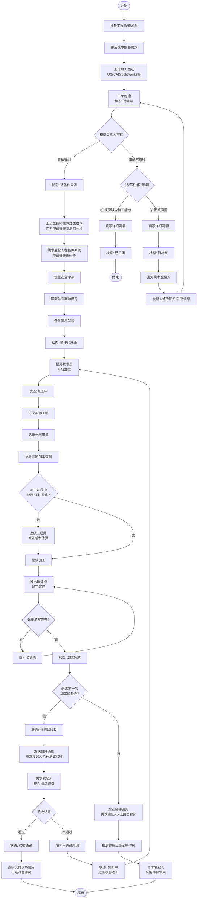
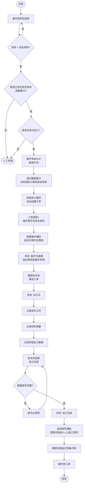
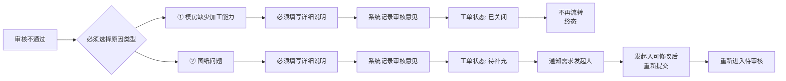
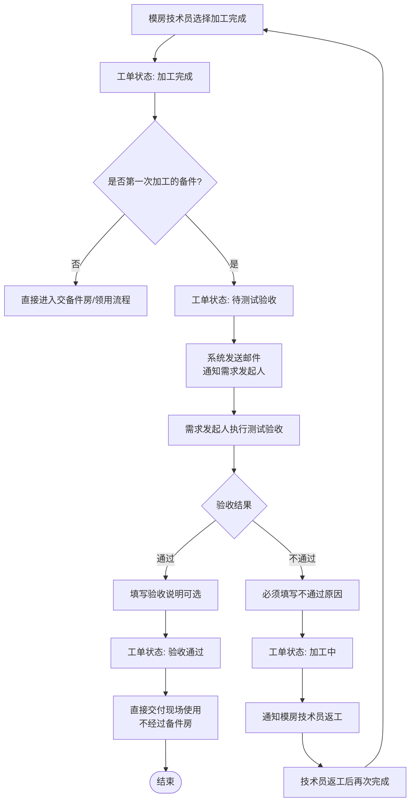
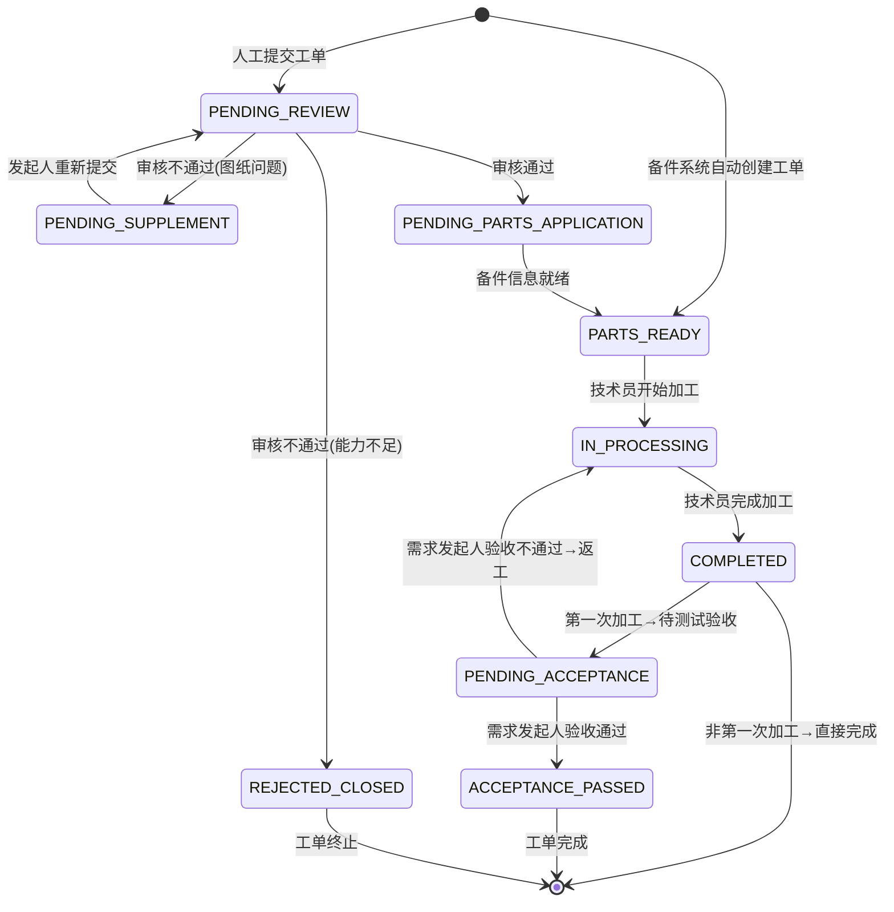

# 机械加工模块 — 业务需求说明 V1.2

> **项目**：EDS（Equipment Data System）  
> **版本**：V1.2  
> **日期**：2026-02-08  
> **状态**：待与备件房确认对接方式  
> **V1.2 变更**：增加第一次加工备件的测试验收环节，由需求发起者执行

---

## 目录

1. [模块概述](#一模块概述)
2. [角色与职责](#二角色与职责)
3. [工单类型](#三工单类型)
4. [业务流程](#四业务流程)
5. [工单状态](#五工单状态)
6. [业务规则](#六业务规则)
7. [数据字段](#七数据字段)
8. [系统对接](#八系统对接)
9. [权限控制](#九权限控制)
10. [通知机制](#十通知机制)
11. [待定事项](#十一待定事项)

---

## 一、模块概述

### 1.1 业务目标

机械加工模块旨在实现机械加工需求的全生命周期管理，包括：

| 目标 | 说明 |
|------|------|
| **需求收集** | 收集设备工程师/技术员的机械加工需求，以图纸为核心载体 |
| **图纸管理** | 支持多种格式图纸（UG/CAD/Solidworks等）的上传、存储、下载和自动关联 |
| **流程管控** | 实现需求提交→审核→备件申请→加工→完成的全流程管控 |
| **加工记录** | 记录加工过程中的关键数据（材料、工时、操作人等） |
| **成本估算** | 基于加工数据估算加工费用，支持动态调整 |
| **自动补货** | 支持备件系统根据安全库存自动触发加工工单 |

### 1.2 技术架构

- **前端**：HTML + JavaScript + jQuery + Bootstrap（与现有EDS模块一致）
- **后端**：Google Apps Script
- **数据存储**：Google Sheets
- **文件存储**：Google Drive 指定公共盘
- **邮件通知**：Google Apps Script MailApp
- **外部集成**：与备件系统（SAP）数据对接

---

## 二、角色与职责

| 角色 | 英文标识 | 职责描述 |
|------|----------|----------|
| **设备工程师/技术员** | Equipment Engineer | • 提出机械加工需求<br>• 上传加工图纸<br>• 审核通过后在备件系统申请备件编码、安全库存等信息<br>• **第一次加工的备件**：加工完成后执行**测试验收**<br>• 验收通过后**直接交付现场使用**（不经过备件房）；该备件再次加工时经备件房领用 |
| **模房负责人** | Mold Shop Manager | • 审核人工提交的加工需求<br>• 判断是否有能力加工<br>• 审核不通过时选择原因并填写说明 |
| **模房技术员** | Mold Shop Technician | • 执行加工任务<br>• 记录实际工时、材料用量等加工数据<br>• 完成加工并将成品交至备件房 |
| **上级工程师** | Senior Engineer | • 需求发起人的直接上级<br>• **审核通过后**在**申请备件信息环节**完成成本估算（与需求发起人申请备件同步进行）<br>• 加工过程中根据实际情况修正成本估算 |

---

## 三、工单类型

### 3.1 工单来源

| 工单类型 | 创建方式 | 标识字段 | 需要审核 | 需要备件申请 | 图纸来源 |
|----------|----------|----------|----------|--------------|----------|
| **常规需求工单** | 设备工程师/技术员手动提交 | 工单类型="常规需求" | ✓ 是 | ✓ 是 | 人工上传 |
| **备件房补充安全库存工单** | 备件系统自动创建（库存&lt;安全库存） | 工单类型="备件房补充安全库存" | ✗ 否 | ✗ 否（视为已就绪） | 系统自动带出 |
| **备件加工-手动触发工单** | 备件系统手动发起采购申请后推送 | 工单类型="备件加工-手动触发" | ✗ 否 | ✗ 否（视为已就绪） | 系统自动带出 |

### 3.2 工单类型对比

#### 常规需求工单特点
- 首次加工或非标准化加工（**第一次加工的备件**）
- 需要模房负责人评估加工能力
- 需要在备件系统建立新的备件档案
- 完整流程：提交→审核→备件申请→加工→完成→**测试验收**（由需求发起者执行）→验收通过后**直接交付现场使用**（不经过备件房）
- **交付方式**：首次加工验收通过 → 直接交付现场使用；该备件**再次加工**时（如安全库存补充）才经备件房交收与领用

#### 备件房补充安全库存工单特点
- 非首次加工（已有历史加工记录）
- 已设定安全库存（数量 ≠ 0）
- 备件系统根据库存水位自动触发
- 简化流程：自动创建→加工→完成
- 图纸从历史记录/备件编码自动关联
- **交付方式**：加工完成后经备件房交收，需求发起人从备件房领用

### 3.3 安全库存为 0 但需加工的备件（已确定：方案 A）

**场景**：备件在备件系统中**安全库存设定为 0**（不设自动补货），但**仍需进行采购/加工**（如按需订购、计划性补货）。此类备件通过下述方式将加工需求触达模房。

**采用方案**：**A. 备件系统手动触发**

- 备件系统**已支持手动触发采购申请**。当安全库存=0 但需加工时，计划员/需求方在备件系统中**手动发起采购申请**（加工需求）。
- 备件系统通过**数据对接**将加工请求推送到机械加工模块，自动创建工单。
- 工单在机械加工模块中需有**明确标识**（如工单类型="备件加工-手动触发" 或 "备件采购加工"），与“备件房补充安全库存”工单区分，但**后续流程一致**：无需审核、备件信息视为已就绪、图纸按备件编码自动带出、模房加工→完成→交备件房→领用。

**与“备件房补充安全库存”的对比**：

| 项目 | 备件房补充安全库存 | 安全库存=0 手动触发 |
|------|---------------------|----------------------|
| 触发条件 | 库存 &lt; 安全库存，且安全库存≠0 | 备件系统手动发起采购申请 |
| 工单类型/标识 | 备件房补充安全库存 | 备件加工-手动触发（或备件采购加工） |
| 后续流程 | 一致 | 一致 |

---

## 四、业务流程

### 4.1 常规需求工单 — 完整流程



### 4.2 备件房补充安全库存工单 — 简化流程



### 4.3 审核不通过处理流程



### 4.4 测试验收流程（仅第一次加工的备件）



**说明**：
- **适用范围**：仅对**常规需求工单**且为**第一次加工的备件**；备件房补充安全库存、备件加工-手动触发工单（非首次加工）不经过测试验收，加工完成后直接交备件房、由需求发起人从备件房领用。
- **首次加工验收通过后**：**直接交付现场使用**，不经过备件房；该备件**再次加工**时（如安全库存补充）才经备件房交收与领用。
- **执行人**：需求发起者（设备工程师/技术员）。
- **验收不通过**：工单回到「加工中」，由模房技术员返工后再次提交「加工完成」，可再次进入测试验收。

---

## 五、工单状态

### 5.1 状态定义

| 状态代码 | 状态名称 | 适用工单类型 | 说明 | 可执行操作 |
|----------|----------|--------------|------|------------|
| **PENDING_REVIEW** | 待审核 | 常规需求 | 需求已提交，等待模房负责人审核 | 模房负责人：审核通过/不通过 |
| **REJECTED_CLOSED** | 已关闭 | 常规需求 | 因加工能力不足被关闭 | 无（终态） |
| **PENDING_SUPPLEMENT** | 待补充 | 常规需求 | 因图纸问题退回，等待补充 | 需求发起人：修改后重新提交 |
| **PENDING_PARTS_APPLICATION** | 待备件申请 | 常规需求 | 审核通过，等待在备件系统申请 | 需求发起人：在备件系统操作 |
| **PARTS_READY** | 备件已就绪 | 全部 | 可以开始加工 | 模房技术员：开始加工 |
| **IN_PROCESSING** | 加工中 | 全部 | 正在加工 | 模房技术员：填写加工数据、完成加工<br>上级工程师：修正成本（若材料/工时变化） |
| **COMPLETED** | 加工完成 | 全部 | 模房技术员已提交完成 | 若为第一次加工→进入待测试验收；否则→交备件房（非首次经备件房领用） |
| **PENDING_ACCEPTANCE** | 待测试验收 | 常规需求（仅第一次加工） | 加工完成，等待需求发起人测试验收 | 需求发起人：执行测试验收（通过/不通过） |
| **ACCEPTANCE_PASSED** | 验收通过 | 常规需求 | 测试验收通过，**直接交付现场使用**（不经过备件房） | 查看、导出（终态） |
| （验收不通过） | — | — | 不单独设状态：验收不通过后工单直接回到「加工中」，由模房技术员返工 | — |

### 5.2 状态流转图



### 5.3 状态过滤与展示

各角色看到的工单列表应按状态过滤：

| 角色 | 主要关注状态 |
|------|--------------|
| 模房负责人 | 待审核 |
| 需求发起人 | 待补充、待备件申请、**待测试验收** |
| 模房技术员 | 备件已就绪、加工中 |
| 上级工程师 | 待备件申请（估算成本）、加工中（修正成本） |

---

## 六、业务规则

### 6.1 审核规则

#### 6.1.1 审核范围
- **需要审核**：常规需求工单
- **无需审核**：备件房补充安全库存工单、备件加工-手动触发工单（自动跳过）

#### 6.1.2 审核不通过必填项
| 项目 | 是否必填 | 说明 |
|------|----------|------|
| 原因类型 | ✓ 必选 | ① 模房缺少加工能力<br>② 图纸问题（尺寸不清、信息不足等） |
| 详细说明 | ✓ 必填 | 文本框，至少10个字符，便于追溯 |

#### 6.1.3 审核后处理
| 原因类型 | 系统处理 | 工单状态 | 是否可重新提交 |
|----------|----------|----------|----------------|
| ① 能力不足 | 直接关闭工单 | 已关闭 | 否 |
| ② 图纸问题 | 退回需求发起人 | 待补充 | 是（修改后重新提交） |

### 6.2 成本估算规则

#### 6.2.1 估算时机
- **首次估算**：**审核通过后**，在**申请备件信息环节**完成（与需求发起人在备件系统申请同步进行），作为该环节的一环；不晚于备件信息就绪
- **修正估算**：加工过程中材料/工时发生变化时允许修改

#### 6.2.2 估算权限
- 仅**上级工程师**可执行成本估算与修正
- 估算记录需保留历史版本（估算时间、估算人、估算值、修改原因）

#### 6.2.3 估算依据（建议）
- 工时费用 = 标准工时单价 × 预计工时
- 材料费用 = 材料单价 × 预计用量
- 其他费用（可选）
- **总成本 = 工时费用 + 材料费用 + 其他费用**

### 6.3 图纸管理规则

#### 6.3.1 图纸格式
- **支持格式**：UG (.prt, .asm)、CAD (.dwg, .dxf)、Solidworks (.sldprt, .sldasm)、PDF、图片等
- **不限制单文件大小**（Google Drive配额允许范围内）
- **不支持在线打开**：仅提供上传与下载功能，用户需本地软件打开

#### 6.3.2 图纸存储
- **存储位置**：Google Drive 指定公共盘（路径在实现时配置）
- **命名规则**（建议）：`工单号_备件编码_图纸名称_版本号.扩展名`
- **版本管理**：同一工单可上传多个图纸，支持版本标注

#### 6.3.3 图纸来源
| 工单类型 | 图纸来源 | 处理方式 |
|----------|----------|----------|
| 常规需求 | 需求发起人手动上传 | 上传到Google Drive，记录文件ID与路径 |
| 备件房补充安全库存 | 系统自动关联 | 根据备件编码从历史工单或备件主数据中获取图纸 |
| 备件加工-手动触发 | 系统自动关联 | 根据备件编码从历史工单或备件主数据中获取图纸 |

### 6.4 加工完成规则

#### 6.4.1 完成条件
模房技术员选择"加工完成"时，系统需校验以下必填项：

| 必填项 | 类型 | 说明 |
|--------|------|------|
| 实际工时 | 数值 | 单位：小时，保留1位小数 |
| 材料用量 | 数值 | 根据材料类型，单位可能不同（kg、m、个等） |
| 操作人 | 文本 | 自动带出当前登录用户 |
| 完成日期 | 日期 | 自动记录提交时间 |

#### 6.4.2 完成后处理（区分是否第一次加工）
- **第一次加工的备件**（常规需求工单）：
  1. 工单状态更新为"待测试验收"
  2. 发送邮件通知需求发起人执行测试验收
  3. 需求发起人验收通过后，状态为"验收通过"，**直接交付现场使用**（不经过备件房）
- **非第一次加工**（如备件房补充安全库存工单、备件加工-手动触发工单）：
  1. 工单状态保持"加工完成"（终态）
  2. 触发邮件通知需求发起人、上级工程师
  3. 模房将成品交至备件房，需求发起人从备件房领用

### 6.5 备件申请规则

#### 6.5.1 申请时机与环节
- 审核通过后（状态变为"待备件申请"）
- **申请备件信息环节**包含两件事（可并行或先后完成）：
  1. **上级工程师**在机械加工模块中完成**成本估算**
  2. **需求发起人**在**备件系统**中申请备件编码、安全库存、供应商等

#### 6.5.2 申请内容
| 项目 | 说明 |
|------|------|
| 备件编码 | 在备件系统中为该加工件申请新的备件编码 |
| 安全库存 | 设置安全库存数量（可为0，表示不自动补货） |
| 供应商 | 设置为"模房" |
| 其他 | 单价、描述等备件系统要求字段 |

#### 6.5.3 就绪判定
- 备件信息在备件系统中维护完成后，通过**数据对接**（方式待定）通知机械加工模块
- 机械加工模块更新工单状态为"备件已就绪"

### 6.6 测试验收规则（仅第一次加工的备件）

#### 6.6.1 适用范围
- **适用**：常规需求工单，且为该备件的**第一次加工**
- **不适用**：备件房补充安全库存、备件加工-手动触发工单（非首次加工，无需测试验收）

#### 6.6.2 执行人
- **需求发起者**（设备工程师/技术员）执行测试验收

#### 6.6.3 验收操作
| 验收结果 | 必填项 | 系统处理 |
|----------|--------|----------|
| **通过** | 验收说明（可选） | 工单状态更新为"验收通过"，**直接交付现场使用**（不经过备件房） |
| **不通过** | 不通过原因（必填） | 工单状态回到"加工中"，通知模房技术员返工 |

#### 6.6.4 返工后再次验收
- 模房技术员返工后再次选择「加工完成」，工单再次进入「待测试验收」
- 需求发起人可再次执行测试验收，直至通过或关闭工单（若业务需要可约定最大返工次数）

---

## 七、数据字段

### 7.1 工单主表字段

| 字段名 | 字段类型 | 是否必填 | 说明 |
|--------|----------|----------|------|
| 工单号 | 文本 | 系统生成 | 格式：MF-YYYYMMDD-XXXX |
| 工单类型 | 枚举 | ✓ | 常规需求 / 备件房补充安全库存 / 备件加工-手动触发 |
| 是否第一次加工 | 布尔 | 常规必填 | 仅常规需求工单使用；备件房补充、备件加工-手动触发固定为否 |
| 工单状态 | 枚举 | ✓ | 见第五节状态定义 |
| 需求发起人 | 文本 | ✓ | 工号（从主数据获取姓名、邮箱） |
| 上级工程师 | 文本 | ✓ | 工号（从主数据获取姓名、邮箱） |
| 备件编码 | 文本 | 自动或手动 | 备件房补充、备件加工-手动触发工单由备件系统带出；常规工单审核通过后在备件系统申请后回填 |
| 工单描述 | 文本 | ✓ | 加工需求简述 |
| 提交日期 | 日期时间 | 自动 | 工单创建时间 |
| 审核人 | 文本 | 可空 | 模房负责人工号 |
| 审核日期 | 日期时间 | 可空 | 审核操作时间 |
| 审核结果 | 枚举 | 可空 | 通过 / 不通过-能力不足 / 不通过-图纸问题 |
| 审核说明 | 文本 | 可空 | 审核不通过时必填 |
| 加工人 | 文本 | 可空 | 模房技术员工号 |
| 开始加工日期 | 日期时间 | 可空 | 状态变为"加工中"时记录 |
| 完成日期 | 日期时间 | 可空 | 状态变为"加工完成"时记录 |
| 实际工时 | 数值 | 完成时必填 | 单位：小时 |
| 材料用量 | 数值 | 完成时必填 | 根据材料类型 |
| 材料单位 | 文本 | 完成时必填 | kg / m / 个 等 |
| 估算成本 | 数值 | 可空 | 上级工程师估算 |
| 验收人 | 文本 | 可空 | 需求发起人工号（测试验收执行人） |
| 验收日期 | 日期时间 | 可空 | 测试验收操作时间 |
| 验收结果 | 枚举 | 可空 | 通过 / 不通过 |
| 验收说明 | 文本 | 可空 | 验收通过时可选；验收不通过时必填原因 |
| 最后修改人 | 文本 | 自动 | 最后一次修改工单的用户 |
| 最后修改时间 | 日期时间 | 自动 | 最后一次修改时间 |

### 7.2 图纸附件表字段

| 字段名 | 字段类型 | 是否必填 | 说明 |
|--------|----------|----------|------|
| 附件ID | 文本 | 系统生成 | 主键 |
| 工单号 | 文本 | ✓ | 外键，关联工单主表 |
| 文件名 | 文本 | ✓ | 原始文件名 |
| 文件扩展名 | 文本 | ✓ | .dwg / .prt / .pdf 等 |
| Google Drive文件ID | 文本 | ✓ | Drive中的唯一标识 |
| 文件大小 | 数值 | ✓ | 单位：字节 |
| 上传人 | 文本 | ✓ | 工号 |
| 上传时间 | 日期时间 | ✓ | 上传时间 |
| 版本号 | 文本 | 可空 | 如 V1.0、V1.1 |
| 备注 | 文本 | 可空 | 图纸说明 |

### 7.3 成本估算历史表字段

| 字段名 | 字段类型 | 是否必填 | 说明 |
|--------|----------|----------|------|
| 记录ID | 文本 | 系统生成 | 主键 |
| 工单号 | 文本 | ✓ | 外键，关联工单主表 |
| 估算人 | 文本 | ✓ | 上级工程师工号 |
| 估算时间 | 日期时间 | ✓ | 估算/修正时间 |
| 估算类型 | 枚举 | ✓ | 首次估算 / 修正估算 |
| 工时费用 | 数值 | ✓ | 单位：元 |
| 材料费用 | 数值 | ✓ | 单位：元 |
| 其他费用 | 数值 | 可空 | 单位：元 |
| 总成本 | 数值 | ✓ | 单位：元 |
| 修改原因 | 文本 | 修正时必填 | 说明为何修正 |

### 7.4 主数据（用户信息）字段

| 字段名 | 字段类型 | 是否必填 | 说明 |
|--------|----------|----------|------|
| 工号 | 文本 | ✓ | 主键 |
| 姓名 | 文本 | ✓ | 中文姓名 |
| 英文名 | 文本 | 可空 | English Name |
| 邮箱 | 文本 | ✓ | 用于邮件通知 |
| 部门 | 文本 | ✓ | 所属部门 |
| 角色 | 文本 | ✓ | 职位/角色 |
| 直接上级工号 | 文本 | 可空 | 用于自动关联上级工程师 |

---

## 八、系统对接

### 8.1 与备件系统对接

#### 8.1.1 对接需求

| 对接方向 | 数据内容 | 业务场景 |
|----------|----------|----------|
| **备件系统 → 机械加工** | 创建工单请求（备件编码、工单描述、工单类型等） | ① 备件房补充安全库存（自动触发）<br>② 安全库存=0 时手动发起采购申请后推送（备件加工-手动触发） |
| **备件系统 → 机械加工** | 备件申请状态（已就绪/未就绪） | 常规工单审核通过后，备件信息就绪通知 |
| **机械加工 → 备件系统** | 工单号、需求发起人、工单描述 | 便于备件系统关联工单 |
| **机械加工 → 备件系统** | 加工完成通知 | 通知备件房准备入库 |

#### 8.1.2 对接方式（待定）

**待与备件房讨论后确定**，可选方案：

1. **API接口**：双方提供RESTful API，实时调用
2. **共享Google Sheets**：约定数据格式，双方读写指定Sheet
3. **定时同步**：通过Google Apps Script定时（如每5分钟）读取对方数据并更新
4. **Webhook**：关键状态变化时主动推送通知

**建议**：优先考虑API或Webhook方式，实时性好；若技术条件限制，可使用共享Sheet方式。

#### 8.1.3 对接数据格式（示例）

**备件系统自动创建工单请求**（JSON格式示例）：

```json
{
  "requestType": "createWorkOrder",
  "workOrderType": "备件房补充安全库存 或 备件加工-手动触发",
  "partsCode": "PT-2024-001",
  "description": "备件PT-2024-001安全库存补充",
  "requester": "EMP001",
  "seniorEngineer": "EMP002",
  "drawingFileId": "1a2b3c4d5e6f7g8h9i0j",
  "timestamp": "2026-02-08T10:30:00Z"
}
```

### 8.2 与Google Drive对接

- **图纸上传**：使用Google Apps Script的 `DriveApp.createFile()` 将文件存储到指定文件夹
- **图纸下载**：生成可分享链接或直接下载链接供用户下载
- **权限控制**：公共盘设置为组织内可见，确保相关人员可访问

### 8.3 与主数据Sheet对接

- **用户信息**：从主数据Sheet读取工号对应的姓名、邮箱、上级等信息
- **更新频率**：系统启动时或定期刷新（如每小时）加载到全局变量，减少重复读取

---

## 九、权限控制

### 9.1 权限矩阵

| 功能模块 | 设备工程师/技术员 | 模房负责人 | 模房技术员 | 上级工程师 |
|----------|-------------------|------------|------------|------------|
| **提交需求** | ✓ 可操作 | - | - | - |
| **查看自己提交的工单** | ✓ 可查看 | - | - | ✓ 可查看（作为上级） |
| **审核工单** | - | ✓ 可操作 | - | - |
| **查看待审核列表** | - | ✓ 可查看 | - | - |
| **查看待补充工单** | ✓ 可查看并修改 | - | - | - |
| **查看待测试验收工单** | ✓ 可查看并操作 | ✓ 可查看 | ✓ 可查看 | ✓ 可查看 |
| **执行测试验收** | ✓ 可操作（通过/不通过） | - | - | - |
| **查看待备件申请工单** | ✓ 可查看 | ✓ 可查看 | - | ✓ 可查看（需估算成本） |
| **估算成本**（申请备件环节） | - | - | - | ✓ 可操作 |
| **查看备件已就绪工单** | ✓ 可查看 | ✓ 可查看 | ✓ 可查看 | ✓ 可查看 |
| **开始加工** | - | - | ✓ 可操作 | - |
| **填写加工数据** | - | - | ✓ 可操作 | - |
| **完成加工** | - | - | ✓ 可操作 | - |
| **修正成本**（加工中） | - | - | - | ✓ 可操作 |
| **查看成本信息** | - | ✓ 可查看 | - | ✓ 可查看 |
| **导出报表** | - | ✓ 可导出 | - | ✓ 可导出 |

### 9.2 权限实现方式

- **基于角色**：从主数据Sheet读取用户角色，前端根据角色显示/隐藏按钮和菜单
- **后端校验**：Google Apps Script后端函数也需校验权限，防止前端绕过
- **工单可见性**：
  - 需求发起人：可查看自己提交的工单
  - 上级工程师：可查看下属提交的工单
  - 模房负责人：可查看所有待审核工单
  - 模房技术员：可查看备件已就绪和加工中的工单

---

## 十、通知机制

### 10.1 邮件通知场景

| 触发场景 | 收件人 | 邮件主题 | 邮件内容要点 |
|----------|--------|----------|--------------|
| **工单提交成功** | 需求发起人 | 【机械加工】工单提交成功 | 工单号、工单描述、当前状态 |
| **审核通过** | 需求发起人、上级工程师 | 【机械加工】工单审核通过 | 工单号、提醒需求发起人在备件系统申请、提醒上级工程师在申请备件环节完成成本估算 |
| **审核不通过（能力不足）** | 需求发起人、上级工程师 | 【机械加工】工单已关闭 | 工单号、关闭原因 |
| **审核不通过（图纸问题）** | 需求发起人 | 【机械加工】工单退回补充 | 工单号、退回原因、修改指引 |
| **备件信息就绪** | 需求发起人、上级工程师、模房技术员 | 【机械加工】工单可开始加工 | 工单号、提醒技术员开始加工 |
| **加工完成** | 需求发起人、上级工程师 | 【机械加工】工单加工完成 | 工单号、完成时间；若第一次加工则提醒执行测试验收 |
| **待测试验收**（第一次加工） | 需求发起人 | 【机械加工】请执行测试验收 | 工单号、工单描述、验收链接 |
| **验收通过** | 需求发起人、上级工程师、模房技术员 | 【机械加工】工单验收通过 | 工单号、提醒**直接交付现场使用** |
| **验收不通过** | 模房技术员、需求发起人 | 【机械加工】工单验收不通过需返工 | 工单号、不通过原因 |
| **自动工单创建** | 模房技术员 | 【机械加工】新的安全库存补充工单 | 工单号、备件编码、工单描述 |

### 10.2 邮件发送方式

- **技术实现**：使用Google Apps Script的 `MailApp.sendEmail()`
- **发件人**：当前脚本/账号（如 `eds-system@company.com`）
- **收件人邮箱来源**：从主数据Sheet根据工号查询邮箱
- **邮件格式**：HTML格式，包含工单详情链接，便于点击直接跳转到系统查看

### 10.3 邮件模板（示例）

**加工完成通知邮件**：

```
主题：【机械加工】工单 MF-20260208-0001 加工完成

尊敬的 [需求发起人姓名]：

您提交的机械加工工单已完成加工：

工单号：MF-20260208-0001
工单描述：齿轮轴加工
备件编码：PT-2024-001
完成时间：2026-02-08 15:30
实际工时：3.5小时
材料用量：2.5kg

（若为第一次加工）请执行测试验收；验收通过后直接交付现场使用。
（若为非首次加工）请前往备件房领用成品。

点击查看工单详情：[工单详情链接]

---
此邮件由EDS机械加工模块自动发送，请勿直接回复。
```

---

## 十一、待定事项

### 11.1 与备件房讨论事项

| 序号 | 待定事项 | 影响范围 | 优先级 |
|------|----------|----------|--------|
| 1 | **备件系统对接方式** | 自动工单创建、备件信息就绪通知 | 高 |
| 2 | **对接数据格式与接口** | 双方开发工作量与时间安排 | 高 |
| 3 | **自动工单的图纸关联规则** | 系统如何根据备件编码找到历史图纸 | 中 |
| 4 | **加工完成后入库流程** | 是否需要在备件系统确认入库后才算完整闭环 | 中 |
| 5 | ~~**安全库存为 0 但需加工的触发方式**~~ | **已确定**：采用方案 A，备件系统已支持手动触发采购申请，通过数据对接推送至机械加工模块，见 3.3 节 | — |
| 6 | **成本估算单价表** | 不同工序/设备的标准工时单价、材料单价 | 低 |

### 11.2 系统设计待定事项

| 序号 | 待定事项 | 说明 | 建议 |
|------|----------|------|------|
| 1 | **主数据Sheet结构** | 用户信息、上级关系等字段 | 提供初步字段清单，与HR系统对齐 |
| 2 | **图纸版本管理** | 是否需要严格版本控制（如审批后才能更新） | 初期可简化，后续按需迭代 |
| 3 | **工单号生成规则** | 是否需要区分工单类型（如常规MF-、补货MFS-） | 建议用统一规则+类型字段区分 |
| 4 | **报表与统计** | 需要哪些维度的统计报表（按月、按备件、按技术员等） | 后续需求澄清会单独讨论 |
| 5 | **移动端支持** | 是否需要移动端（手机/平板）访问 | 若需要，考虑响应式设计或独立移动页面 |

### 11.3 后续迭代方向

- **工艺路线**：记录加工工艺步骤（粗加工→精加工→检验等）
- **质量检验**：加工完成后增加质检环节与记录
- **批次管理**：一个工单对应多个加工件时的批次跟踪
- **设备管理**：记录使用的加工设备/机床，便于设备利用率分析
- **智能估算**：基于历史数据自动预测工时和成本

---

## 十二、版本历史

| 版本 | 日期 | 修改内容 | 修改人 |
|------|------|----------|--------|
| V1.0 | 2026-02-08 | 初稿：基本流程、角色、工单类型、状态、规则 | - |
| V1.1 | 2026-02-08 | 完善流程图（Mermaid）、补充数据字段、通知机制、待定事项 | - |
| V1.2 | 2026-02-08 | 增加第一次加工备件的测试验收环节；明确交付方式：首次加工验收通过后**直接交付现场使用**（不经过备件房），该备件再次加工时才经备件房领用 | - |
| V1.2 | 2026-02-08 | **成本估算提前**：审核通过后在**申请备件信息环节**完成（与备件申请同步），由上级工程师执行；备件已就绪后仅保留加工中修正成本 | - |
| V1.2 | 2026-02-08 | **安全库存为 0 但需加工**：补充场景与待定事项 3.3，列出触发方式可选方案（备件系统手动触发/机械加工侧发起/按需触发），待与备件房讨论 | - |
| V1.2 | 2026-02-08 | **安全库存=0 触发方式确定**：采用方案 A，备件系统已支持手动触发采购申请；新增工单类型「备件加工-手动触发」，流程与备件房补充安全库存一致 | - |

---

## 附录：术语表

| 术语 | 英文 | 说明 |
|------|------|------|
| 机械加工 | Machining / Manufacturing | 通过车、铣、磨、钻等工艺对材料进行加工 |
| 模房 | Mold Shop | 负责模具制造与机械加工的部门 |
| 备件房 | Spare Parts Room | 负责备件存储与发放的部门 |
| 安全库存 | Safety Stock | 为应对需求波动而设置的最低库存量 |
| 工单 | Work Order | 机械加工任务的载体，记录需求到完成的全过程 |
| UG | Unigraphics NX | 西门子的CAD/CAM软件 |
| CAD | Computer-Aided Design | 计算机辅助设计 |
| Solidworks | - | 达索系统的3D CAD软件 |

---

**文档结束**
